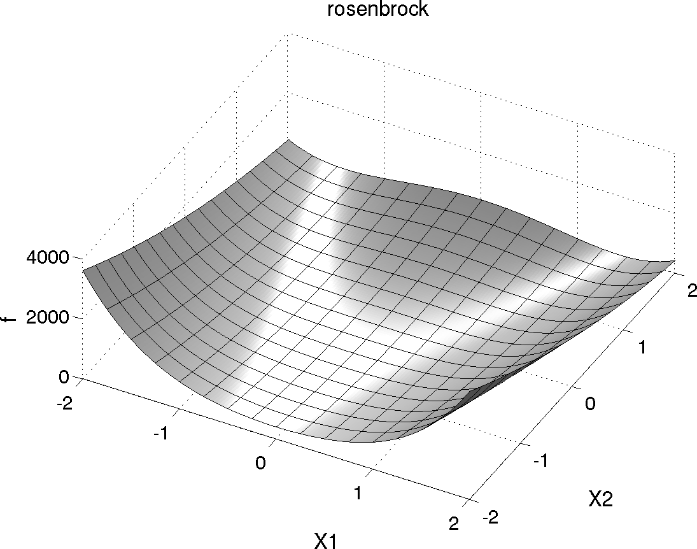
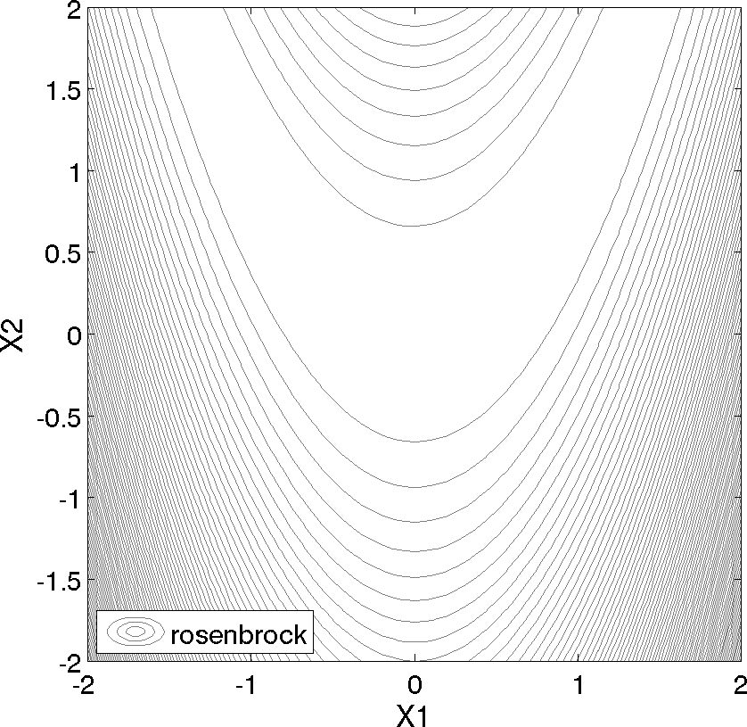
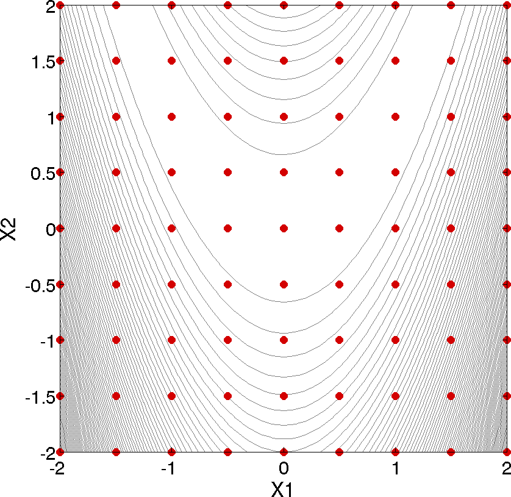
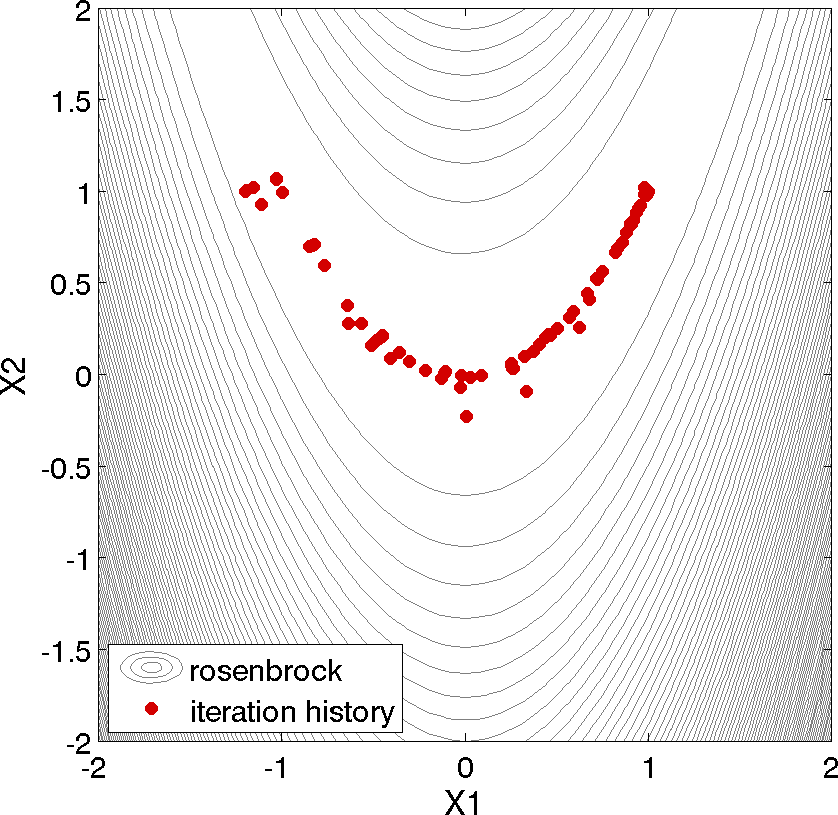
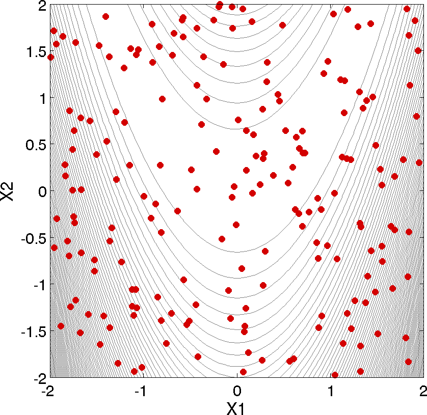
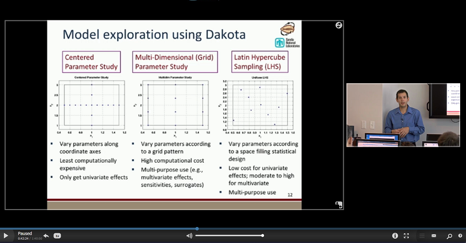

"Getting Started" Examples
=======================================

```{eval-rst}
.. _examples-gettingstarted-main:
```

This section serves to familiarize users with how to perform parameter studies, optimization, and uncertainty quantification
through their common Dakota interface. The initial examples utilize simple built in driver functions; later we show how to
utilize Dakota to drive the evaluation of user supplied black box code. The examples presented in this chapter are intended to
show the simplest use of Dakota for methods of each type. More advanced examples of using Dakota for specific purposes are
provided in subsequent, topic-based, chapters.


```{eval-rst}
   :ref:`If you are looking for examples of coupling Dakota to external simulations, click here <couplingtosimulations-main>`.
   
   :ref:`If you are looking for video examples, click here <examples-gettingstarted-videos>`.
```

## Rosenbrock Test Problem

The Rosenbrock function is a common test problem for Dakota examples. This function has the form:

```{eval-rst}

.. math::

   f(x_1,x_2)=100(x_2-x_1^2)^2+(1-x_1)^2
```

Shown below is a three-dimensional plot of this function, where both x1 and x2 range in value from −2 to 2;
also shown below is a contour plot for Rosenbrock’s function. 

|  |  |
|---|---|
| 3D Plot | Contour Plot |

An optimization problem using Rosenbrock’s function is formulated as follows:

```{eval-rst}

.. math::

   \begin{eqnarray}
   \texttt{minimize }   & & f(x_1,x_2)          \nonumber\\
                        & & \mathbf{x} \in \Re^2\nonumber\\
   \texttt{subject to } & & -2 \le x_1 \le 2    \\
                        & & -2 \le x_2 \le 2    \nonumber
   \end{eqnarray}
```

Note that there are no linear or nonlinear constraints in this formulation, so this is a bound constrained optimization problem.
The unique solution to this problem lies at the point (x1, x2) = (1, 1), where the function value is zero.
Several other test problems are available. See Chapter 20 for a description of these test problems as well as further discussion
of the Rosenbrock test problem.

## Parameter Studies

### Two-Dimensional Grid Parameter Study



Parameter study methods in the Dakota toolkit involve the computation of response data sets at a selection of points in the
parameter space. These response data sets are not linked to any specific interpretation, so they may consist of any allowable
specification from the responses keyword block, i.e., objective and constraint functions, least squares terms and constraints, or
generic response functions. This allows the use of parameter studies in direct coordination with optimization, least squares,
and uncertainty quantification studies without significant modification to the input file.
An example of a parameter study is the 2-D parameter study example problem listed in Figure 2.4. This is executed by Dakota
using the command noted in the comments:

```
dakota -i rosen_multidim.in -o rosen_multidim.out > rosen_multidim.stdout
```

The output of the Dakota run is written to the file named rosen_multidim.out while the screen output, or standard output,
is redirect to rosen_multidim.stdout. For comparison, files named rosen_multidim.out.sav and rosen_
multidim.stdout.sav are included in the dakota/share/dakota/examples/users directory. As for many of
the examples, Dakota provides a report on the best design point located during the study at the end of these output files.

This 2-D parameter study produces the grid of data samples shown in Figure 2.6. In general, a multidimensional parameter
study lets one generate a grid in multiple dimensions. The keyword multidim parameter study indicates that a grid
will be generated over all variables. The keyword partitions indicates the number of grid partitions in each dimension.
For this example, the number of the grid partitions are the same in each dimension (8 partitions) but it would be possible to
specify (partitions = 8 2), and have only two partitions over the second input variable. Note that the graphics flag in the
environment block of the input file could be commented out since, for this example, the iteration history plots created by Dakota
are not particularly instructive. More interesting visualizations can be created by using the Dakota graphical user interface,
or by importing Dakota’s tabular data into an external graphics/plotting package. Example graphics and plotting packages
include Mathematica, Matlab, Microsoft Excel, Origin, Tecplot, Gnuplot, and Matplotlib. (Sandia National Laboratories and
the Dakota developers do not endorse any of these commercial products.)

### Vector Parameter Study

The following sample input file shows a 1-D vector parameter study using the Textbook Example (see Textbook). It makes use of the default environment and model specifications, so they can be omitted. A similar file is available in the test directory as dakota/share/dakota/examples/users/rosen_ps_vector.in.

```
# Dakota Input File: rosen_ps_vector.in
environment
 tabular_data
  tabular_data_file = 'rosen_ps_vector.dat'

method
 vector_parameter_study
  final_point = 1.1 1.3
  num_steps = 10

variables
 continuous_design = 2
  initial_point  -0.3   0.2
  descriptors    'x1'   "x2"

interface
 analysis_driver = 'rosenbrock'
  direct

responses
 objective_functions = 1
 no_gradients
 no_hessians
```

## Optimization

### Gradient-based Unconstrained Optimization

Dakota’s optimization capabilities include a variety of gradient-based and nongradient-based optimization methods. This
subsection demonstrates the use of one such method through the Dakota interface.

```
# Dakota Input File: rosen_grad_opt.in
# Usage:
# dakota -i rosen_grad_opt.in -o rosen_grad_opt.out > rosen_grad_opt.stdout
environment
  tabular_data
    tabular_data_file = ’rosen_grad_opt.dat’
	
method
  conmin_frcg
    convergence_tolerance = 1e-4
    max_iterations = 100

model
  single
  
variables
  continuous_design = 2
  initial_point -1.2 1.0
  lower_bounds -2.0 -2.0
  upper_bounds 2.0 2.0
  descriptors ’x1’ "x2"
  
interface
  analysis_drivers = ’rosenbrock’
    direct

responses
  objective_functions = 1
  # analytic_gradients
  numerical_gradients
    method_source dakota
    interval_type forward
    fd_step_size = 1.e-5
  no_hessians
```

The format of the input file is similar to that used for the parameter studies, but there are some new keywords in the responses and method sections.
First, in the responses block of the input file, the keyword block starting with numerical gradients specifies that a finite
difference method will be used to compute gradients for the optimization algorithm. Note that the Rosenbrock function evalu-
ation code inside Dakota has the ability to give analytical gradient values. (To switch from finite difference gradient estimates
to analytic gradients, uncomment the analytic gradients keyword and comment out the four lines associated with the
numerical gradients specification.) Next, in the method block of the input file, several new keywords have been added.
In this block, the keyword conmin frcg indicates the use of the Fletcher-Reeves conjugate gradient algorithm in the CON-
MIN optimization software package [143] for bound-constrained optimization. The keyword max iterations is used to
indicate the computational budget for this optimization (in this case, a single iteration includes multiple evaluations of Rosen-
brock’s function for the gradient computation steps and the line search steps). The keyword convergence tolerance
is used to specify one of CONMIN’s convergence criteria (under which CONMIN terminates if the objective function value
differs by less than the absolute value of the convergence tolerance for three successive iterations).

The Dakota command is noted in the file, and copies of the outputs are in the dakota/share/dakota/examples/
users directory, with .sav appended to the name. When this example problem is executed using Dakota’s legacy X
Windows-based graphics support enabled, Dakota creates some iteration history graphics similar to the screen capture shown
in Figure 2.8(a). These plots show how the objective function and design parameters change in value during the optimization
steps. The scaling of the horizontal and vertical axes can be changed by moving the scroll knobs on each plot. Also, the
“Options” button allows the user to plot the vertical axes using a logarithmic scale. Note that log-scaling is only allowed if the
values on the vertical axis are strictly greater than zero. Similar plots can also be created in Dakota’s graphical user interface.




Above, we can see the iteration history of the optimization algorithm. The optimization starts at the point (x1, x2) =
(−1.2, 1.0) as given in the Dakota input file. Subsequent iterations follow the banana-shaped valley that curves around toward
the minimum point at (x1, x2) = (1.0, 1.0). Note that the function evaluations associated with the line search phase of each
CONMIN iteration are not shown on the plot. At the end of the Dakota run, information is written to the output file to provide
data on the optimal design point. These data include the optimum design point parameter values, the optimum objective and
constraint function values (if any), plus the number of function evaluations that occurred and the amount of time that elapsed
during the optimization study.

### Optimization Example #2

The following sample input file shows single-method optimization of the Textbook Example (see Textbook) using DOT's modified method of feasible directions. A similar file is available as dakota/share/dakota/examples/users/textbook_opt_conmin.in.

```
# Dakota Input File: textbook_opt_conmin.in
environment
 tabular_data
  tabular_data_file = 'textbook_opt_conmin.dat'

method
# dot_mmfd #DOT performs better but may not be available
 conmin_mfd
  max_iterations = 50
  convergence_tolerance = 1e-4

variables
 continuous_design = 2
  initial_point  0.9  1.1
  upper_bounds   5.8  2.9
  lower_bounds   0.5  -2.9
  descriptors   'x1'  'x2'

interface
 direct
  analysis_driver =    'text_book'

responses
 objective_functions = 1
 nonlinear_inequality_constraints = 2
 numerical_gradients
  method_source dakota
  interval_type central
  fd_gradient_step_size = 1.e-4
 no_hessians
```

## Uncertainty Quantification with Monte Carlo Sampling

```
# Dakota Input File: rosen_sampling.in
# Usage:
# dakota -i rosen_sampling.in -o rosen_sampling.out > rosen_sampling.stdout

environment
  tabular_data
    tabular_data_file = ’rosen_sampling.dat’

method
  sampling
    sample_type random
    samples = 200
    seed = 17
    response_levels = 100.0

model
  single

variables
  uniform_uncertain = 2
  lower_bounds -2.0 -2.0
  upper_bounds 2.0 2.0
  descriptors ’x1’ ’x2’

interface
  analysis_drivers = ’rosenbrock’
    direct
	
responses
  response_functions = 1
  no_gradients
  no_hessians
```

Uncertainty quantification (UQ) is the process of determining the effect of input uncertainties on response metrics of interest.
These input uncertainties may be characterized as either aleatory uncertainties, which are irreducible variabilities inherent in
nature, or epistemic uncertainties, which are reducible uncertainties resulting from a lack of knowledge. Since sufficient data
is generally available for aleatory uncertainties, probabilistic methods are commonly used for computing response distribution
statistics based on input probability distribution specifications. Conversely, for epistemic uncertainties, data is generally sparse,
making the use of probability theory questionable and leading to nonprobabilistic methods based on interval specifications.
The subsection demonstrates the use of Monte Carlo random sampling for Uncertainty Quantification.

Figure 2.9 shows the Dakota input file for an example problem that demonstrates some of the random sampling capabilities
available in Dakota. In this example, the design parameters, x1 and x2, will be treated as uncertain parameters that have
uniform distributions over the interval [-2, 2]. This is specified in the variables block of the input file, beginning with the
keyword uniform uncertain. Another difference from earlier input files such as Figure 2.7 occurs in the responses
block, where the keyword response functions is used in place of objective functions. The final changes to the
input file occur in the method block, where the keyword sampling is used.

The other keywords in the methods block of the input file specify the number of samples (200), the seed for the random number
generator (17), the sampling method (random), and the response threshold (100.0). The seed specification allows a user to
obtain repeatable results from multiple runs. If a seed value is not specified, then Dakota’s sampling methods are designed to
generate nonrepeatable behavior (by initializing the seed using a system clock). The keyword response levels allows
the user to specify threshold values for which Dakota will output statistics on the response function output. Note that a unique
threshold value can be specified for each response function.

In this example, Dakota will select 200 design points from within the parameter space, evaluate the value of Rosenbrock’s
function at all 200 points, and then perform some basic statistical calculations on the 200 response values.

The Dakota command is noted in the file, and copies of the outputs are in the dakota/share/dakota/examples/
users directory, with .sav appended to the name. Figure 2.10 shows example results from this sampling method. Note that
your results will differ from those in this file if your seed value differs or if no seed is specified.

In addition to the output files discussed in the previous examples, several LHS*.out files are generated. They are a byproduct
of a software package, LHS [136], that Dakota utilizes to generate random samples and can be ignored.

```
Statistics based on 200 samples:

Moment-based statistics for each response function:
                            Mean           Std Dev          Skewness          Kurtosis
 response_fn_1  4.5540183516e+02  5.3682678089e+02  1.6661798252e+00  2.7925726822e+00

95% confidence intervals for each response function:
                    LowerCI_Mean      UpperCI_Mean    LowerCI_StdDev    UpperCI_StdDev
 response_fn_1  3.8054757609e+02  5.3025609422e+02  4.8886795789e+02  5.9530059589e+02

Level mappings for each response function:
Cumulative Distribution Function (CDF) for response_fn_1:
     Response Level  Probability Level  Reliability Index  General Rel Index
     --------------  -----------------  -----------------  -----------------
   1.0000000000e+02   3.4000000000e-01

Probability Density Function (PDF) histograms for each response function:
PDF for response_fn_1:
          Bin Lower          Bin Upper      Density Value
          ---------          ---------      -------------
   1.1623549854e-01   1.0000000000e+02   3.4039566059e-03
   1.0000000000e+02   2.7101710856e+03   2.5285698843e-04

Simple Correlation Matrix among all inputs and outputs:
                       x1           x2 response_fn_1 
          x1  1.00000e+00 
          x2 -5.85097e-03  1.00000e+00 
response_fn_1 -9.57746e-02 -5.08193e-01  1.00000e+00 

Partial Correlation Matrix between input and output:
             response_fn_1 
          x1 -1.14659e-01 
          x2 -5.11111e-01 

Simple Rank Correlation Matrix among all inputs and outputs:
                       x1           x2 response_fn_1 
          x1  1.00000e+00 
          x2 -6.03315e-03  1.00000e+00 
response_fn_1 -1.15360e-01 -5.04661e-01  1.00000e+00 

Partial Rank Correlation Matrix between input and output:
             response_fn_1 
          x1 -1.37154e-01 
          x2 -5.08762e-01 
```

As shown in Figure 2.10, the statistical data on the 200 Monte Carlo samples is printed at the end of the output file in the section
that starts with “Statistics based on 200 samples.” In this section summarizing moment-based statistics, Dakota outputs the
mean, standard deviation, skewness, and kurtosis estimates for each of the response functions. For example, the mean of the
Rosenbrock function given uniform input uncertainties on the input variables is 455.4 and the standard deviation is 536.8.
This is a very large standard deviation, due to the fact that the Rosenbrock function varies by three orders of magnitude over
the input domain. The skewness is positive, meaning this is a right-tailed distribution, not a symmetric distribution. Finally,
the kurtosis (a measure of the “peakedness” of the distribution) indicates that this is a strongly peaked distribution (note that
we use a central, standardized kurtosis so that the kurtosis of a normal is zero). After the moment-related statistics, the 95%
confidence intervals on the mean and standard deviations are printed. This is followed by the fractions (“Probability Level”)
of the response function values that are below the response threshold values specified in the input file. For example, 34 percent
of the sample inputs resulted in a Rosenbrock function value that was less than or equal to 100, as shown in the line listing
the cumulative distribution function values. Finally, there are several correlation matrices printed at the end, showing simple
and partial raw and rank correlation matrices. Correlations provide an indication of the strength of a monotonic relationship
between input and outputs. More detail on correlation coefficients and their interpretation can be found in Section 5.2.1. More
detail about sampling methods in general can be found in Section 5.2. Finally, Figure 2.11 shows the locations of the 200
sample sites within the parameter space of the Rosenbrock function for this example.



## Least Squares (Calibration)

The following sample input file shows a nonlinear least squares (calibration) solution of the Rosenbrock Example (see Rosenbrock) using the NL2SOL method. A similar file is available as dakota/share/dakota/examples/users/rosen_opt_nls.in 

```
# Dakota Input File: rosen_opt_nls.in
environment
 tabular_data
  tabular_data_file = 'rosen_opt_nls.dat'

method
 max_iterations = 100
 convergence_tolerance = 1e-4
 nl2sol

model
 single

variables
 continuous_design = 2
  initial_point  -1.2   1.0
  lower_bounds   -2.0   -2.0
  upper_bounds   2.0   2.0
  descriptors    'x1'   "x2"

interface
 analysis_driver = 'rosenbrock'
  direct

responses
 calibration_terms = 2
 analytic_gradients
 no_hessians
```

## Nondeterministic Analysis

The following sample input file shows Latin Hypercube Monte Carlo sampling using the Textbook Example (see Textbook). A similar file is available as dakota/share/dakota/test/dakota_uq_textbook_lhs.in.

```
method,
    sampling,
     samples = 100 seed = 1
     complementary distribution
     response_levels = 3.6e+11 4.0e+11 4.4e+11
              6.0e+04 6.5e+04 7.0e+04
              3.5e+05 4.0e+05 4.5e+05
     sample_type lhs

variables,
    normal_uncertain = 2
     means       = 248.89, 593.33
     std_deviations  =  12.4,  29.7
     descriptors    = 'TF1n' 'TF2n'
    uniform_uncertain = 2
     lower_bounds   = 199.3, 474.63
     upper_bounds   = 298.5, 712.
     descriptors    = 'TF1u' 'TF2u'
    weibull_uncertain = 2
     alphas      =  12.,  30.
     betas       = 250.,  590.
     descriptors    = 'TF1w' 'TF2w'
    histogram_bin_uncertain = 2
     num_pairs  = 3     4
     abscissas  = 5 8 10 .1 .2 .3 .4
     counts   = 17 21 0 12 24 12  0
     descriptors = 'TF1h' 'TF2h'
    histogram_point_uncertain = 1
     num_pairs  = 2
     abscissas  = 3 4
     counts   = 1 1
     descriptors = 'TF3h'

interface,
    fork asynch evaluation_concurrency = 5
     analysis_driver = 'text_book'

responses,
    response_functions = 3
    no_gradients
    no_hessians
```

## Hybrid Strategy

The following sample input file shows a hybrid environment using three methods. It employs a genetic algorithm, pattern search, and full Newton gradient-based optimization in succession to solve the Textbook Example (see Textbook). A similar file is available as dakota/share/dakota/examples/users/textbook_hybrid_strat.in.

```
environment
 hybrid sequential
  method_list = 'PS' 'PS2' 'NLP'

method
 id_method = 'PS'
 model_pointer = 'M1'
 coliny_pattern_search stochastic
  seed = 1234
  initial_delta = 0.1
  variable_tolerance = 1.e-4
  solution_accuracy = 1.e-10
  exploratory_moves basic_pattern
  #verbose output

method
 id_method = 'PS2'
 model_pointer = 'M1'
 max_function_evaluations = 10
 coliny_pattern_search stochastic
  seed = 1234
  initial_delta = 0.1
  variable_tolerance = 1.e-4
  solution_accuracy = 1.e-10
  exploratory_moves basic_pattern
  #verbose output

method
 id_method = 'NLP'
 model_pointer = 'M2'
    optpp_newton
  gradient_tolerance = 1.e-12
  convergence_tolerance = 1.e-15
  #verbose output

model
 id_model = 'M1'
 single
  variables_pointer = 'V1'
  interface_pointer = 'I1'
  responses_pointer = 'R1'

model
 id_model = 'M2'
 single
  variables_pointer = 'V1'
  interface_pointer = 'I1'
  responses_pointer = 'R2'

variables
 id_variables = 'V1'
 continuous_design = 2
  initial_point  0.6  0.7
  upper_bounds   5.8  2.9
  lower_bounds   0.5  -2.9
  descriptors   'x1'  'x2'

interface
 id_interface = 'I1'
 direct
  analysis_driver= 'text_book'

responses
 id_responses = 'R1'
 objective_functions = 1
 no_gradients
 no_hessians

responses
 id_responses = 'R2'
 objective_functions = 1
 analytic_gradients
 analytic_hessians
```

```{eval-rst}
.. _examples-gettingstarted-videos:
```

## Video Resources

| Title | Link | Resources|
| --- | --- | --- |
| More Method Examples with Rosenbrock | [](https://www.youtube.com/watch?v=jPd5zarUs1o&list=PLouetuxaIMDo-NMFXT-hlHYhOkePLrayY&index=3) | |
| Model Characterization | [](http://digitalops.sandia.gov/Mediasite/Play/536240e97b444ee19a24d55c72fd52941d) | ([Slides](https://dakota.sandia.gov/sites/default/files/training/DakotaTraining_ModelCharacterization.pdf) / [Exercises](https://dakota.sandia.gov/sites/default/files/training/characterization-151215.zip)) |