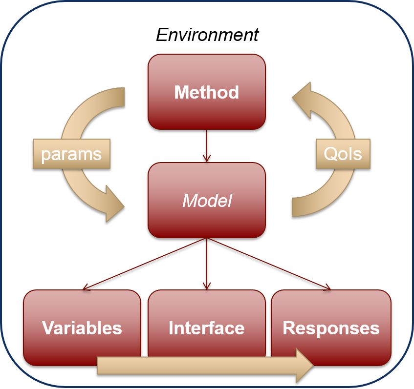

Dakota Input File
=======================================

[](https://www.youtube.com/watch?v=f1l8DIXd9Gs&list=PLouetuxaIMDo-NMFXT-hlHYhOkePLrayY&index=2)

There are six specification blocks that may appear in Dakota input files. These are identified in the input file using the following
keywords: variables, interface, responses, model, method, and environment. While, these keyword blocks can appear in any
order in a Dakota input file, there is an inherent relationship that ties them together. The simplest form of that relationship is
shown below:



<p style="text-align: center;"><strong>Relationship between the six blocks, for a simple study.</strong></p>

It can be summarized as follows: In each iteration of its algorithm, a method block requests a variables-
to-responses mapping from its model, which the model fulfills through an interface. While most Dakota analyses satisfy this
relationship, where a single method runs a single model, advanced cases are possible and are discussed in Chapter 14.

```
# Dakota Input File: rosen_multidim.in
# Usage:
# dakota -i rosen_multidim.in -o rosen_multidim.out > rosen_multidim.stdout

environment
  tabular_data
    tabular_data_file = ’rosen_multidim.dat’

method
  multidim_parameter_study
    partitions = 8 8
	
model
  single
  
variables
  continuous_design = 2
  lower_bounds -2.0 -2.0
  upper_bounds 2.0 2.0
  descriptors ’x1’ "x2"
  
interface
  analysis_drivers = ’rosenbrock’
    direct
  
responses
  response_functions = 1
  no_gradients
  no_hessians
```

As a concrete example, a simple Dakota input file, rosen_multidim.in, is shown above, for a two-dimensional
parameter study on Rosenbrock’s function. This input file will be used to describe the basic format and syntax used in all
Dakota input files. The results are shown later, in Section 2.3.2.

The first block of the input file is the **environment block.** This keyword block is used to specify the
general Dakota settings such as Dakota’s graphical output (via the graphics flag) and the tabular data output (via the
tabular data keyword). In advanced cases, it also identifies the top method pointer that will control the Dakota
study. The environment block is optional, and at most one such block can appear in a Dakota input file.

The **method block** of the input file specifies which iterative method Dakota will employ and associated method options. The
keyword multidim parameter study in Figure 2.4 calls for a multidimensional parameter study, while the keyword
partitions specifies the number of intervals per variable (a method option). In this case, there will be eight intervals (nine
data points) evaluated between the lower and upper bounds of both variables (bounds provided subsequently in the variables
section), for a total of 81 response function evaluations. At least one method block is required, and multiple blocks may appear
in Dakota input files for advanced studies.

The **model block** of the input file specifies the model that Dakota will use. A model provides the logical unit for determining
how a set of variables is mapped through an interface into a set of responses when needed by an iterative method. In the
default case, the model allows one to specify a single set of variables, interface, and responses. The model block is optional in
this simple case. Alternatively, it can be explicitly defined as in Figure 2.4, where the keyword single specifies the use of
a single model in the parameter study. If one wishes to perform more sophisticated studies such as surrogate-based analysis
or optimization under uncertainty, the logical organization specified in the model block becomes critical in informing Dakota
on how to manage the different components of such studies, and multiple model blocks are likely needed. See Chapter 8 for
relevant advanced model specification details.

The **variables block** of the input file specifies the number, type, and characteristics of the parameters that will be varied
by Dakota. The variables can be classified as design variables, uncertain variables, or state variables. Design variables are
typically used in optimization and calibration, uncertain variables are used in UQ and sensitivity studies, and state variables are
usually fixed. In all three cases, variables can be continuous or discrete, with discrete having real, integer, and string subtypes.
See Chapter 9 for more information on the types of variables supported by Dakota. The variables section shown in Figure 2.4
specifies that there are two continuous design variables. The sub-specifications for continuous design variables provide the
descriptors “x1” and “x2” as well as lower and upper bounds for these variables. The information about the variables is
organized in column format for readability. So, both variables x1 and x2 have a lower bound of -2.0 and an upper bound of
2.0. At least one variables block is required, and multiple blocks may appear in Dakota input files for advanced studies.

The **interface block** of the input file specifies the simulation code that will be used to map variables into responses as well
as details on how Dakota will pass data to and from that code. In this example, the keyword direct is used to indicate
the use of a function linked directly into Dakota, and data is passed directly between the two. The name of the function is
identified by the analysis driver keyword. Alternatively, fork or system executions can be used to invoke instances
of a simulation code that is external to Dakota as explained in Section 2.3.5.2 and Chapter 16. In this case, data is passed
between Dakota and the simulation via text files. At least one interface block is required, and multiple blocks may appear in
Dakota input files for advanced studies.

The **responses block** of the input file specifies the types of data that the interface will return to Dakota. They are categorized
primarily according to usage. Objective functions are used in optimization, calibration terms in calibration, and response
functions in sensitivity analysis and UQ. For the example shown in Figure 2.4, the assignment response functions =
1 indicates that there is only one response function. The responses block can include additional information returned by the
interface. That includes constraints and derivative information, both discussed in Chapter 11. In this example, there are no
constraints associated with Rosenbrock’s function, so the keywords for constraint specifications are omitted. The keywords
no gradients and no hessians indicate that no derivatives will be provided to the method; none are needed for a
parameter study. At least one responses block is required, and multiple blocks may appear in Dakota input files for advanced
studies.

---

```{eval-rst}

.. toctree::
   :maxdepth: 1
   
   inputfile/formatting
   inputfile/model
   inputfile/variables
   inputfile/interfaces
   inputfile/responses
   inputfile/inputstodakota
   inputfile/outputsfromdakota
   inputfile/inputspec   
```