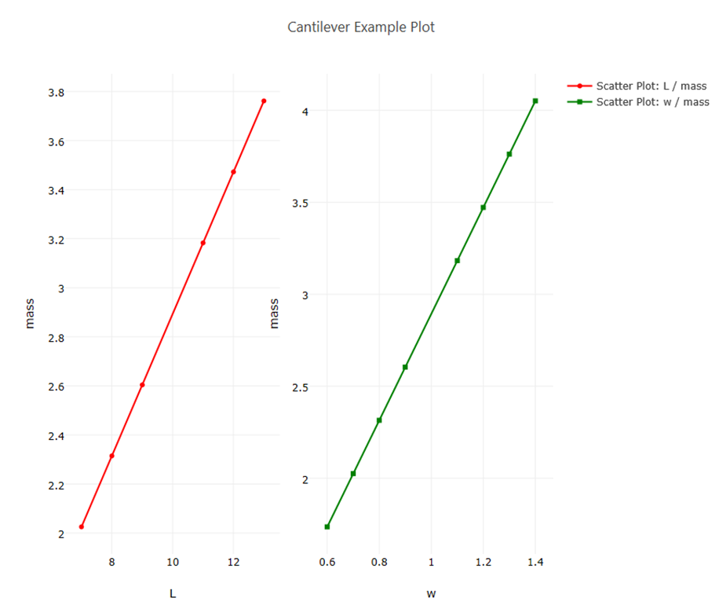

Chartreuse
==========

```{eval-rst}
.. toctree::
   :maxdepth: 1
   
   chartreuse/PlotTraceCreator
   chartreuse/EditingPlotFiles
   chartreuse/PlotManager
   chartreuse/ColorScales
   chartreuse/PlotTemplates
   chartreuse/ChartreuseSandbox
   chartreuse/ChartreuseWorkflow
```

**Introduction**

<a name="introduction"></a>

Chartreuse is a plotting library provided with the Dakota GUI that allows you to explore the data in Dakota output files by creating graphical plots.  A number of different 2D and 3D plot types are supported.

*Note:*  Currently, the Dakota GUI fully supports Chartreuse plotting on Windows and Mac.  For Linux, only RHEL7 and newer are supported (other comparably new Fedora-based distributions would be supported as well).  In addition, Chartreuse plotting is limited to 2D on Linux.

**Plotting Terminology**

<a name="plotting-terminology"></a>

Before you begin plotting, there are three major terms used in Chartreuse that you should learn.  Understanding these will give you a lot of flexibility in the types of plots you can create.

* **Plot Trace** A plot trace is the most basic grouping of information that can be visualized in the Dakota GUI.  A trace represents a single Dakota variable (either parameter or response) visually rendered in some way.  A trace could be a series of points plotted on a Cartesian plane (i.e. a scatter plot).  A trace can also be represented in other ways that we don’t naturally think of as “tracing” (such as a histogram)
* **Plot Canvas** A plot canvas can be thought of a single set of axes.  A canvas can be either 2D or 3D.  A plot canvas can display one or more plot traces by grouping them onto the same axes.
* **Plot Window** A plot window is the top-level container for Chartreuse plot data.  A plot window can contain one or more plot canvases.  Only one plot window can be rendered at a time, but you can have multiple plot windows open at once by making use of editor tabs.  Plot windows are saved as .plot files in the Project Explorer view.

Here is an illustration of these plotting terms:



In this image, we see **two canvases** - the one on the left and the one on the right.  Each of these canvases has **one trace** on it - the left canvas has a red trace and the right canvas has a green trace.  All of this is rendered onto **one plot window**.  The plot window is named "Cantilever Example Plot."

**Plot Dataset Terminology**

<a name="plot-dataset-terminology"></a>

In Chartreuse, plot datasets can either be interpreted as one-dimensional or two-dimensional.

* **One-dimensional dataset** A plot dataset is said to be one-dimensional if it only contains column-style data.  That is, it must only have data labels along the top of the dataset, and the column below that label represents a one-dimensional data series for that label.  For example, a Dakota tabular data file can be described in Chartreuse terminology as a one-dimensional dataset.
* **Two-dimensional dataset** A plot dataset is said to be two-dimensional if it contains grid-style data.  That is, data labels exist along two axes, and a data point in the grid is described by the intersection of two data labels.  For example, a Dakota correlation matrix can be described in Chartreuse terminology as a two-dimensional dataset.