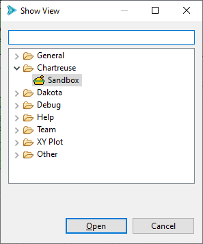
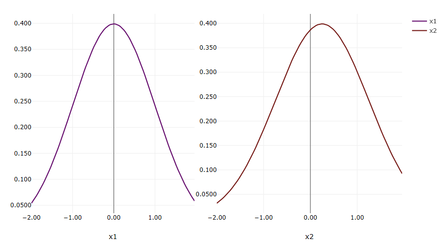
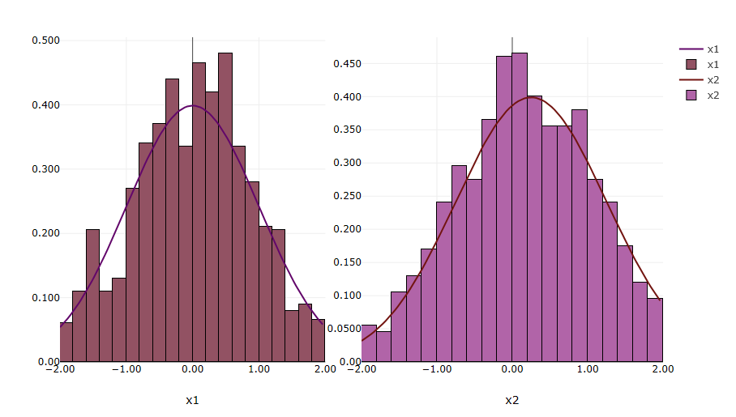
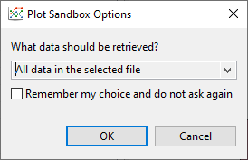

Chartreuse Sandbox View
=======================

##Table of Contents
1. [Introduction](#introduction)
2. [Supported Data Sources](#supported-data-sources)
3. [Sending Data to the Sandbox](#sending-data)
4. [Options (or How to Play in the Sandbox)](#options)
5. [Recommended Reading](#recommended-reading)

##Introduction

Historically, Chartreuse has required the user to provide some upfront configuration before they can turn a data output file into a visualized plot.  However, there's often a need to quickly visualize the data using the most reasonable default options.

To that end, the Chartreuse Sandbox View can be thought of a "staging area" where the user can send data, look at that data, and overlay it with other datasets for comparison purposes.  With the Sandbox, there's no need to worry about things like configuring how the data will be extracted, how the canvases will be laid out, etc.

By default, the Chartreuse Sandbox View is hidden.  It can be activated in one of two ways:

* Trigger the Sandbox View to appear by [sending data to it](#sending-data).
* Open the "Show View" dialog by selecting Window > Show View > Other..., then selecting Chartreuse > Sandbox.

##Supported Data Sources

The Chartreuse Sandbox View can receive data from the following sources of plot data:

* CSV files
* Dakota input files (i.e. the PDF curve of a given uncertainty variable)
* Dakota tabular data files
* Dakota-based HDF5 files (generic HDF5 files are not supported)

##Sending Data to the Sandbox

There are two primary methods to send data to the Sandbox.  Both methods will be illustrated using a single example.

###Method 1:  Embedded Buttons Located throughout the GUI

Buttons have been made available at key locations in Dakota GUI to send currently-selected data to the Sandbox.

**Dakota Visual Editor:  Variables Table**

While viewing a Dakota variables block in the [Dakota Visual Editor](DakotaInputFiles.html#dakota-visual-editor), you can select one or more variables to enable the "Auto-Visualize Variable" button.  The variables selected must belong to an *uncertain* variable category.  Selecting this button will immediately visualize the *probability density function* for each variable in the Sandbox.

For example, suppose we send both x1 and x2 to the Sandbox.  We will see the PDF of their normal uncertainty distributions right away:

*Pro Tip*:  Viewing Dakota variables in their category-specific tables allows for quick editing of the variable's properties.  This makes it extremely easy to modify a Dakota variable and immediately re-send it to the Sandbox to see how changing a value impacts the PDF curve.  The "View category" dropdown allows you to switch which variable table you are viewing.

###Method 2:  Project Explorer Context Menu

You can also right-click a file that contains [plottable data](#supported-data-sources) in the Project Explorer view.  Select "Chartreuse" in the context menu, then the "Fast plot in sandbox" sub-menu.  From here, you have a number of options for creating plots quickly with no configuration.

For example, let's continue with the example of two Dakota normal uncertain variables x1 and x2.  Suppose we ran a sampling study in Dakota using x1 and x2, and we generated a tabular data file containing data for the variables.  Selecting the histogram option will overlay a histogram over each variable curve, showing the rough correspondence between the expected curve and the actual data.

*Note:* The first time you send file data to the Sandbox, you may see this dialog asking which datasets you want to send to the Sandbox:

Depending on what you want to do, you may want to send all the file data to the Sandbox, or only the data matching labels that are already in the Sandbox (what we did in the previous example), or even the data that doesn't match the labels in the Sandbox.  It just depends on what you want to visualize.  You can also opt to not show this dialog again once you have made your preferred selection.

##Options (or How to Play in the Sandbox)

Once you have some data in the Sandbox view, you have some options for how to manipulate it.

* **Save** Save the plot to a file.  You can choose .plot (native Chartreuse format), .png (still screenshot), or .html (for web-based viewing of the plot).
* **Edit** Change the label of any given canvas in the Sandbox.  Note that this will impact data grouping if you later try to automatically combine plots with matching data labels.
* **Edit Color** Change the color of a given trace.
* **Delete** Delete a canvas (and all its traces) from the Sandbox.
* **Delete All** Delete all data in the Sandbox.  *This button will not prompt you to be sure about deleting your data.*
* **Layout Strategy** Tell the Sandbox what to do with matching data labels:
 * **Replace Matching Labels** If a dataset is added to the Sandbox and it matches the label of an existing canvas, the existing canvas will be removed in favor of the dataset being added.
 * **Overlay Matching Labels** (this is the default option) If a dataset is added to the Sandbox and it matches the label of an existing canvas, the two datasets will be combined onto the same canvas.
 * **Group Matching Labels** If a dataset is added to the Sandbox and it matches the label of an existing canvas, the added dataset will be placed on a new canvas located to the right of the existing canvas.
* **Manually Overlay** Force two plot traces to be combined onto the same canvas, even if they are unrelated datasets.

##Recommended Reading

* For more traditional Chartreuse plotting options, [see the main Chartreuse documentation page](Chartreuse.html).
* For visualizing PDF curves of Dakota's uncertain variable types using Next-Gen Workflow, [see the page on Chartreuse/Next-Gen Workflow integration](ChartreuseWorkflow.html#ngw-uncertainty-variables).