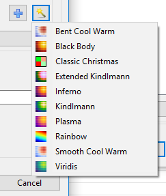

Using Color Scales in Plot Traces
=================================

Color scales allow you to customize a gradient of colors for your plot.  Here is an example color scale you could specify in the [Plot Trace Creator](#plot-trace-basic) dialog:

Color scales are made up of one or more rows of colors.  Each row has its own button bar for individual customization:

* **Set Color (the color wheel icon)** Choose a color for this row.
* **Move Up** Move the row upwards in the list of colors.
* **Move Down** Move the row downwards in the list of colors.
* **Remove** Delete this row.

For each row, the chosen color and the *value on which the color transition resides* is displayed in the text field to the left of the button bar.  Note that color scales do not permit out-of-order color transition values.  The values must be organized from smallest to largest to make sense for a color scale.

* **Color Axis** The "Color Axis" dropdown allows you to define *which axis the color gradient applies to.*  By default, the color gradient will apply to the Z axis to accentuate depth for 3D (or implied 3D) plots.  For certain types of plots (such as 3D scatter plots), you can change which axis the color scale applies to.  For example, you could set this dropdown to a set of timestep values, which would create the effect of using color to represent change over time.
* **Color Value Type** You can specify the meaning of the color scale values using the "Color Value Type" dropdown.  If "Data Values" is selected, then the value in each color scale row corresponds to a specific point in your plotted dataset.  If "Relative Percentages" is selected, then the value in each color scale is normalized on a 0-100 percentage scale, where 0 is the smallest value in your dataset, and 100 is the largest value in your dataset.
* **Color Scale Type** You can specify a continuous color scale or a color scale with discrete transitions using the "Color Scale Type" dropdown.

Finally, there are two more buttons to explain:

* **Add (the blue plus icon)** Adds another row to the color scale.
* **Use Color Scale Template (the wizard icon)** Choose from a library of color scale templates.
 * See ["Color Map Advice for Scientific Visualization" by Kenneth Moreland](https://http://www.kennethmoreland.com/color-advice/).

