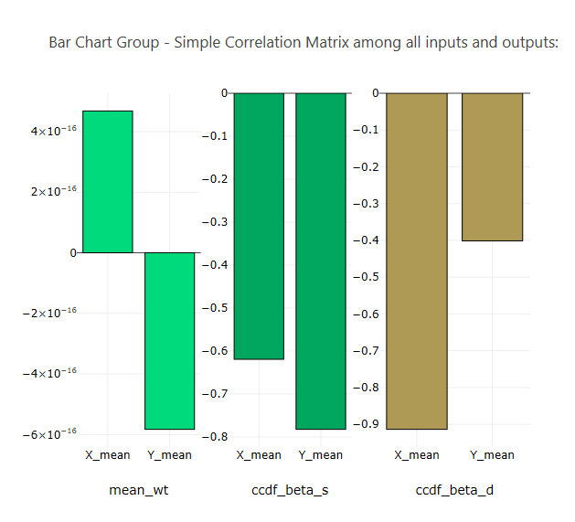
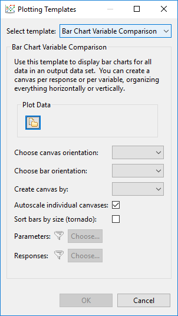
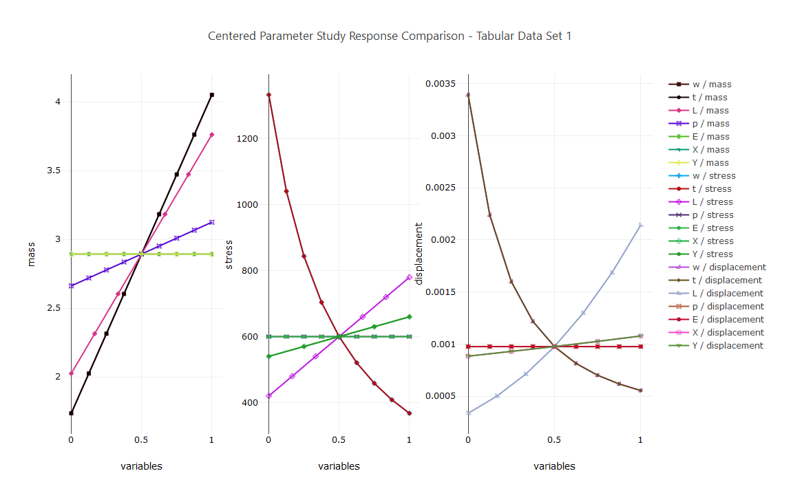
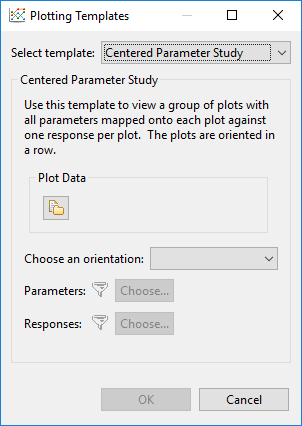
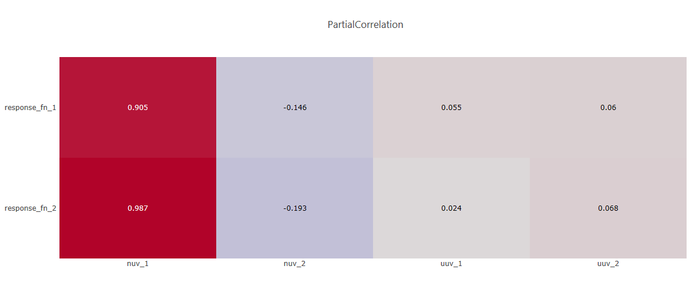
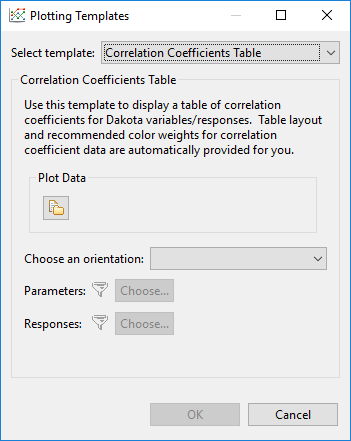
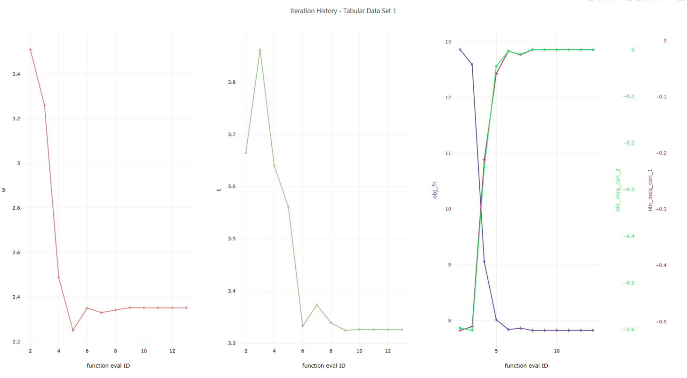
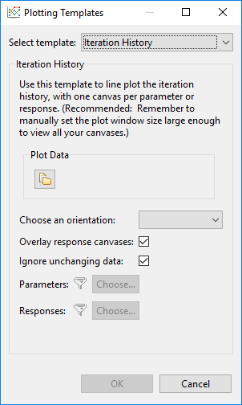
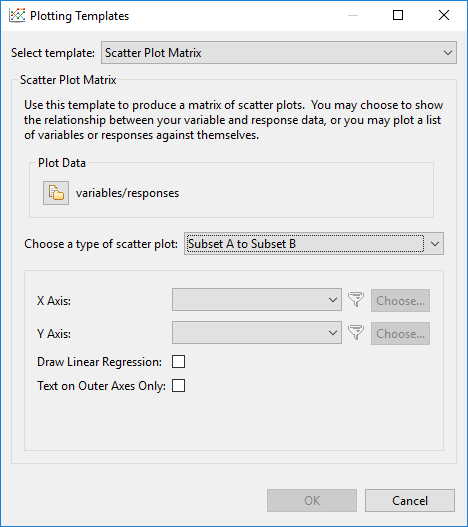
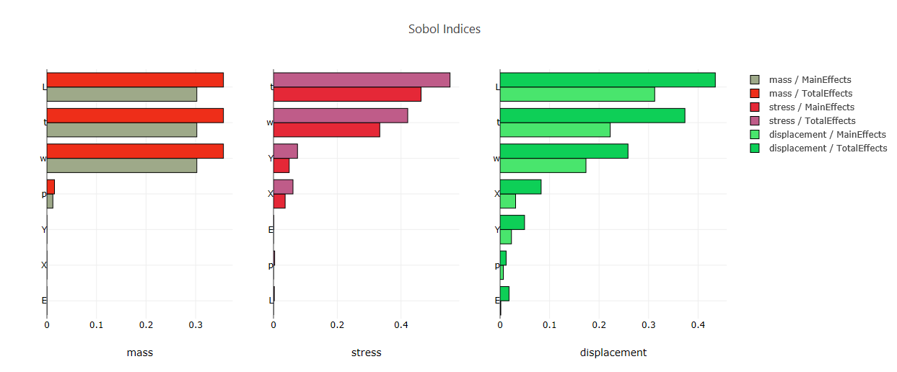

Plot Templates
==========

The Plotting Templates dialog fills a usage gap between the [Plot Trace Creator](#plot-trace-basics) dialog and the [Plot Window Manager](#the-plot-manager-dialog) dialog...

* The Plot Trace Creator dialog is limited to create single-trace, single-canvas plots.
* The Plot Window Manager dialog becomes increasingly time-consuming to use as you manually add more canvases and traces.  For instance, creating a comprehensive view of the Dakota centered parameter study for the cantilever beam model would require 21 traces (7 variables x 3 responses), which would take a long time to manually input, not to mention the fact that doing so is error-prone, requiring lots of trial and error to get the plot exactly the way you want it.

The Dakota GUI includes templates that facilitate easy access to the most common types of plots that you would need as part of a study performed by Dakota.  To access the Plotting Templates dialog, either...

* From the Plot Window Manager dialog, click on the "Choose a plotting template" button in the top-left corner.
* Right-click on a file containing plottable data and select Chartreuse > New plot template from this file.

Each available plotting template is described in detail in the following sections.

## Bar Chart Variable Comparison

* **Plot Data** Select a plottable data source, as in [the Plot Trace Creator dialog](#plot-data-selection)
* **Choose canvas orientation** Determine whether generated canvases will be added horizontally or vertically.
* **Choose bar orientation** Determine whether bars in the bar charts will be oriented vertically or horizontally.
* **Create canvas by** Create one canvas per response or one canvas per variable.  If "Response" is chosen, variables will act as the independent variables of each canvas.  If "Variable" is chosen, responses will act as the independent variables of each canvas.  If "All" is chosen, a canvas will be created for each variable and each response, and each variable/response relationship will be represented on each canvas.  "All" is not recommended unless you have a small number of variables and responses.
* **Autoscale individual canvases** If selected, "autoscale" rules are applied to each canvas, so that each canvas ignores the scale of every other canvas.
* **Sort bars by size (tornado)** Organizes the bars of each bar chart by *absolute value magnitude*, to create the visual image of a tornado.
* **Filter Parameters and Responses** Use these options to filter parameters and responses from being included in the final plot.

## Centered Parameter Study

* **Plot Data** Select a plottable data source, as in [the Plot Trace Creator dialog](#plot-data-selection)
* **Choose an orientation** Determine whether generated canvases will be added horizontally or vertically.
* **Filter Parameters and Responses** Use these options to filter parameters and responses from being included in the final plot.

## Correlation Coefficient Table

*Note:* The color scale for your correlation coefficients table is not controlled by this template.  Instead, this is controlled by [the global Chartreuse preference for default color scale](Preferences.html#chartreuse).

* **Plot Data** Select a plottable data source, as in [the Plot Trace Creator dialog](#plot-data-selection)
* **Choose an orientation** Determine whether the correlation coefficients table should put responses on the vertical axis and variables on the horizontal axis, or vice versa.  You can also choose "Mirror All Variables" to put both variables and responses on both the horizontal and vertical axes.
* **Filter Parameters and Responses** Use these options to filter parameters and responses from being included in the final plot.

## Iteration History

* **Plot Data** Select a plottable data source, as in [the Plot Trace Creator dialog](#plot-data-selection)
* **Choose an orientation** Determine whether generated canvases will be added horizontally or vertically.
* **Overlay response canvases** Group responses onto a single stack of overlaid canvases.
* **Ignore unchanging data** If a variable's value does not change over the course of the study, it does not get its own canvas in the final plot.
* **Filter Parameters and Responses** Use these options to filter parameters and responses from being included in the final plot. 

## Scatter Plot Matrix

* **Plot Data** Select a plottable data source, as in [the Plot Trace Creator dialog](#plot-data-selection)
* **Choose a type of scatter plot**
 * **Subset A to Subset B** Allows you to put variables along one axis and responses along the other axis.
 * **All to All** Allows you to put all variables and all responses on each axis.

* **X Axis** Specify the data for the X axis (only available for the "Subset A to Subset B" option)
* **Y Axis** Specify the data for the Y axis (only available for the "Subset A to Subset B" option)
* **Axis** Specify the data for both axes (only available for the "All to All" option)
* **Draw Linear Regression** Draw a linear regression line on each generated canvas.
* **Blank Diagonal** Do not put data along the diagonal, where a variable or response will be mapped against itself (only available for the "All to All" option)
* **Draw Lower Half Only** Do not put mirrored data on the upper triangle of the grid of canvases (only available for the "All to All" option)
* **Text on Outer Axes Only** Do not repeat canvas text for canvases that are "inside" the grid.  If unchecked, this will lead to redundant canvas labels throughout your final plot.

## Sobol Indices

*Pro Tip:* If you select a plottable data file that contains Sobol index data, the Plotting Templates dialog will automatically retrieve this data for you. 

* **Plot Data** Select a plottable data source, as in [the Plot Trace Creator dialog](#plot-data-selection)
* **Effects Type** For Sobol indices, we can plot the main effects dataset, the total effects dataset, or both.
* **One canvas per effects type** Split main effects and total effects onto separate canvases.
* **One canvas per response type** Create a canvas for each response.
* **Sort** Sort the bars by absolute value magnitude (i.e. a tornado plot).
* **Filter Parameters and Responses** Use these options to filter parameters and responses from being included in the final plot.  