```{eval-rst}
.. _chartreuse-plot-trace:
```

Plot Trace Creator
==================

If you want to plot a single trace quickly and easily, use the Plot Trace Creator.  You can access it by selecting a file with plottable data.  Chartreuse recognizes the following file formats as sources of plottable data:

* CSV files
* Dakota tabular data files (with some caveats)
* HDF5 files

Right-click the chosen file in the Project Explorer view and select New > Plot trace from this file to access the Plot Trace Creator dialog.

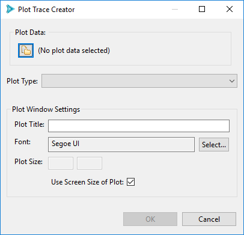

Let’s talk about the Plot Window Settings options group (the bottom half of this dialog).  These are options global to your entire plot window:

* **Plot Title** The title displayed at the top of your plot.
* **Font** The font used by your graph.
* **Plot Size** The size of your plot in pixels.  This  is useful to customize if you are interested in exporting your plot at a large size (for instance, for a publication), or if the default view of your data is too crowded.  By default, the plotting library will scale your plot to fit within the size of the editor in your perspective.

## Getting Plot Data

Along the top of this dialog is the Plot Data group.  There is a single button in this group (the file-and-folder icon button, hereafter referred to as the "Get Data" button) that allows you to select different data sets from the Dakota GUI for the purpose of plotting. 

<a name="plot-data-selection"></a>

### Getting Plot Data from a CSV File

<a name="getting-data-from-csv"></a>

Chartreuse supports CSV files as a possible data source.  When you select the Get Data button from the Plot Trace Creator dialog, you will be presented with the following dialog:


This dialog allows you to choose a different CSV file if you wish (it will be default populated with the CSV file you used earlier when you selected "Plot trace from this file" from the Chartreuse context menu).  You can also choose whether to interpret the first row of the CSV file as a header row or not.

### Getting Plot Data from a Dakota Tabular Data File

<a name="getting-data-from-tabular-data"></a>

Dakota's tabular data output file is another possible provider of plottable data.  However, it is not sufficient to create a Chartreuse plot, because Dakota tabular data does not designate which columns belong to variables, and which columns belong to responses.  Therefore, when creating a Chartreuse plot from Dakota tabular data, we also need to provide the original Dakota input file, which *does* have variable and response information in it.

When you select the Get Data button from the Plot Trace Creator dialog, the following dialog will display:


You must satisfy this two-file requirement by selecting the original Dakota input file in the left tree view, and the tabular data file in the right tree view.

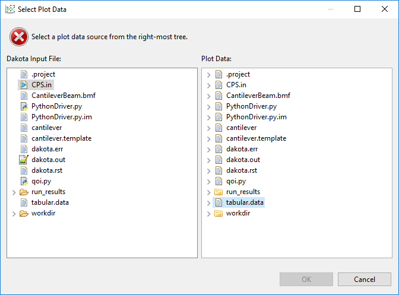

In addition, tabular data files can contain more than one set of tabular data, so you will need to expand the tabular data file by clicking on the little arrow to its left, and choosing the proper tabular data set contained within.

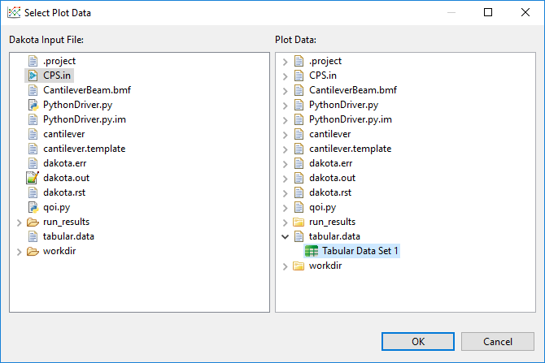

*Note:* If you accidentally select the wrong Dakota input file or the wrong tabular data file, this dialog will warn you of a mismatch between the variable and response lists. 

*Pro Tip:*  Before you opened the Plot Trace Creator dialog, if you selected a Dakota tabular data file, right-clicked, and chose "Chartreuse > New plot trace from this file," AND you only have one Dakota study in your project, the Select Plot Data dialog will automatically deduce the connection between the tabular data file and your original Dakota study for you.

Click OK to return to the Plot Trace Creator.  Note that the tabular data set we selected in the previous dialog, "Tabular Data Set 1", is now in the Plot Data group.

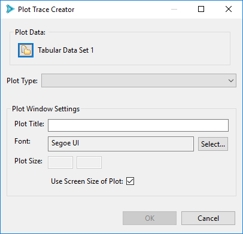

### Getting Plot Data from a Dakota HDF5 Database File

<a name="getting-data-from-dakota-hdf5"></a>

This section discusses how to plot data from a **Dakota-generated HDF5 file**.  For plotting data out of a general HDF5 file, see the next section.

Selecting a plottable dataset from a Dakota HDF5 database file requires some rudimentary knowledge of Dakota's HDF5 layout.  It is recommended that you refer to these reference manual sections first:

* [General information about Dakota's HDF5 Output](https://dakota.sandia.gov//sites/default/files/docs/latest_release/html-ref/hdf5_output.html)
* [Accessing HDF5 Data in the Dakota GUI](HDF.html)

Suppose you have right-clicked a .h5 file created by Dakota, and then selected "Chartreuse > New plot trace from this file."  If you click on the Get Data button from the Plot Trace Creator dialog, you will be presented with the following data selection dialog:

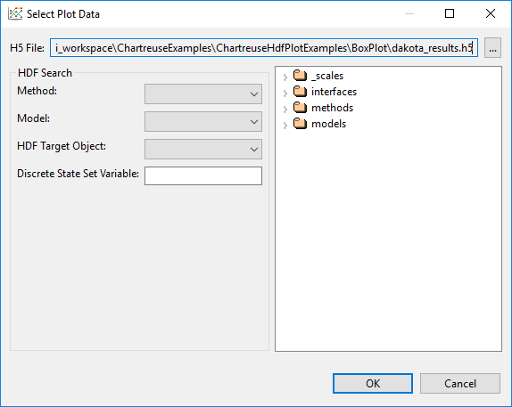

* **H5 File** This file selection control allows you to choose the .h5 file you want to search.  If you right-clicked on an .h5 file before entering the Plot Trace Creator dialog, this field will already be populated for you.
* **HDF5 Dataset Tree** The tree on the right displays the hierarchical data contained within your selected HDF5 file.  You can use this tree to manually locate the dataset you want to plot.
* **HDF5 Search Group** If you don't want to manually locate the dataset, use the controls in this group to automatically locate specific datasets.
 * **Method** This dropdown provides a list of method IDs contained in the .h5 file.  If your Dakota study only had one method block / one method ID, you can ignore this dropdown.
 * **Model** This dropdown provides a list of model IDs contained in the .h5 file.  If your Dakota study only had one model block / one model ID, you can ignore this dropdown.
 * **HDF5 Target Object** Perhaps the most useful dropdown in the search group, this dropdown provides you with a list of *known, plottable Dakota HDF5 datasets.*  There are only a handful of specific HDF5 datasets that are recognized by Dakota GUI today.  But with each release, we are working to support more and more of these datasets.
 * **Discrete State Set Variable**<a name="dakota-hdf-discrete-state-set-name"></a> The only time you would fill this field out is if you are creating a plot [with categorical axes](#plot-trace-barchart-categorical).  Categorical axes on a scatter plot imply data that comes from a Dakota discrete state set.  Therefore, you would put the name of the discrete state set containing the categorical axes in this field.

*Note:* If you select a dataset that doesn't exist, or is not plottable, this dialog will provide a warning.


### Getting Plot Data from a General HDF5 Database File

<a name="getting-data-from-plain-hdf5"></a>

The previous section describes a plot data dialog that is highly tailored to Dakota-specific concepts and datasets.  If you have imported a non-Dakota .h5 file into your workspace, you can still create plots from it using Chartreuse.

First, go to the [Chartreuse section of the Preferences window](Preferences.html#chartreuse) and change the Default Plot Data Provider to "HDF5 Plot Data Provider", not "Dakota/HDF5 Plot Data Provider."

Right-click your .h5 file and choose "Chartreuse > New plot trace from this file."

Click on the Get Data button, and you'll be presented with this dialog.


You are responsible for traversing the HDF5 database and locating the dataset you want to plot.


You also must tell Chartreuse [how you want the dataset to be interpreted](#plot-dataset-terminology).

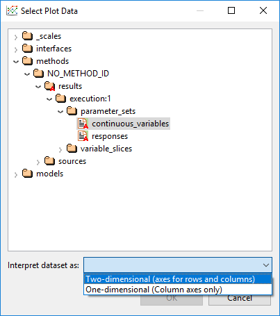

Click OK when you are done.

*Note:* HDF5 dimension scales are not currently supported for plain, non-Dakota HDF5 database files.  Therefore, if your database contains column labels, they will not be displayed - instead, you must refer to your data in the Plot Trace Creator dialog by index (i.e. "Column 0", "Column 1", etc.)

## Bar Charts

<a name="plot-trace-barchart"></a>


*Note:* Bar charts require [two-dimensional plot datasets](#plot-dataset-terminology).

Use this option to create standard bar charts.

* **Data** The data element to use as the *dependent variable* for your bar chart.  *Independent variables* are gathered from the opposite side of the two-dimensional dataset.
* **Orientation** Determines whether the bars are oriented vertically or horizontally.
* **Bar Color** The color of each bar.

## Bar Charts (Categorical Data)

<a name="plot-trace-barchart-categorical"></a>


*Note:* Bar charts require [two-dimensional plot datasets](#plot-dataset-terminology).

Use this option if you want the independent axis of your bar chart to come from a categorical dataset with discrete state entries.  This type of plot is best used in conjunction with [Dakota-generated HDF5 files, with the source of the discrete state set provided.](#dakota-hdf-discrete-state-set-name)

* **Data** The data element to use as the *dependent variable* for your bar chart.  *Independent variables* are gathered from the specified discrete data set.
* **Orientation** Determines whether the bars are oriented vertically or horizontally.
* **Bar Color** The color of each bar.

## Box Plots

<a name="plot-trace-box"></a>

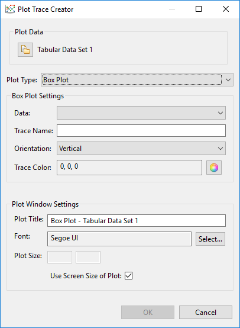

Use this option to create a standard [box-and-whisker plot](https://en.wikipedia.org/wiki/Box_plot).

* **Data** The data element to use for your box plot.  Box plots are one-dimensional, so only one Dakota variable or response needs to be provided.
* **Trace Name** A custom label for your data trace.  The trace label does not get displayed as part of the final plot, but it's a good idea to give your traces memorable names in case you need to find them again later.
* **Orientation** Determines whether the box plot is oriented vertically or horizontally.
* **Trace Color** The color of the box plot.

## Contour Plots

<a name="plot-trace-contour"></a>

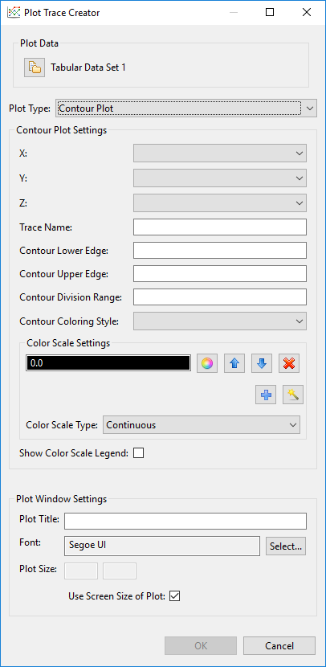

Use this option to create a standard [contour plot](https://www.statisticshowto.datasciencecentral.com/contour-plots/).

* **X/Y/Z** Data for the X, Y, and Z dimensions of the contour plot.  You can choose any combination of Dakota parameters and responses.
* **Trace Name** A custom label for your data trace.  The trace label does not get displayed as part of the final plot, but it's a good idea to give your traces memorable names in case you need to find them again later.
* **Contour Lower Edge** The starting contour value.  No contours will be drawn below this value.
* **Contour Upper Edge** The ending contour value.  No contours will be drawn above this value.
* **Contour Division Range** The step size between contours.
* **Contour Coloring Style** The style of coloring for the contour plot.
 * **Fill** Coloring is done evenly between each contour level. 
 * **Heatmap** A heatmap gradient coloring is applied between each contour level.
 * **Lines** Coloring is done on the contour lines.
 * **None** No coloring is applied on this trace.
* **Color Scale Settings** Specify a [color scale](#color-scales) for your contour plot.  Use the wizard icon to choose from a library of recommended color scales.
* **Show Color Scale Legend** Determines whether or not a color scale legend is displayed on the right-hand side of your plot.

## Heat Maps

<a name="plot-trace-heatmap"></a>

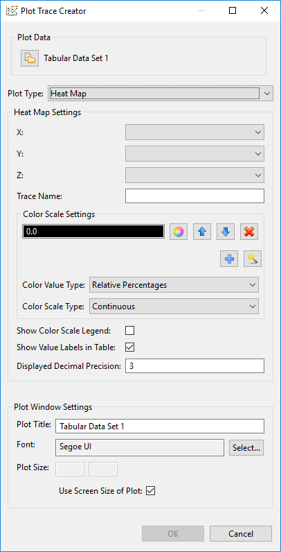

Use this option to create a standard [heatmap](https://en.wikipedia.org/wiki/Heat_map).

* **X/Y/Z** Data for the X, Y, and Z dimensions of the contour plot.  You can choose any combination of Dakota parameters and responses.
* **Trace Name** A custom label for your data trace.  The trace label does not get displayed as part of the final plot, but it's a good idea to give your traces memorable names in case you need to find them again later.
* **Color Scale Settings** Specify a [color scale](#color-scales) for your heatmap.  Use the wizard icon to choose from a library of recommended color scales.
* **Show Color Scale Legend** Determines whether or not a color scale legend is displayed on the right-hand side of your plot.
* **Show Value Labels in Table** If selected, the value corresponding to each square of the heatmap will be displayed in the center of that square.
* **Displayed Decimal Precision** If values are being displayed in each square of the heatmap, you can also specify an integer value that will determine the number of decimal places to display for each value.

## Heat Maps (Categorical Axes)

<a name="plot-trace-heatmap-categorical"></a>


*Note:* Heatmaps with categorical axes require plot datasets that have **two** data label axes - one for each side of the heatmap.

Use this option to create a [heatmap](https://en.wikipedia.org/wiki/Heat_map) that has categorical axes rather than numerical axes.

* **Orientation** Choose the orientation for your heat map.  You can place variables on the horizontal axis and responses on the vertical axis ("Variable-Response"), or vice versa ("Response-Variable").  You can also mirror variables against themselves ("Variable-Variable"), responses against themselves ("Response-Response"), or all variables and responses against themselves ("All-All").
* **Color Scale Settings** Specify a [color scale](#color-scales) for your heatmap.  Use the wizard icon to choose from a library of recommended color scales.
* **Show Color Scale Legend** Determines whether or not a color scale legend is displayed on the right-hand side of your plot.
* **Show Value Labels in Table** If selected, the value corresponding to each square of the heatmap will be displayed in the center of that square.
* **Displayed Decimal Precision** If values are being displayed in each square of the heatmap, you can also specify an integer value that will determine the number of decimal places to display for each value.
* **Parameter and Response Filters** Filter which parameters and responses will be shown on the final heatmap.

## Histograms

<a name="plot-trace-histogram"></a>


Use this option to create a [histogram](https://en.wikipedia.org/wiki/Histogram).

* **Data** The data element to use for your histogram.  Histograms are one-dimensional, so only one Dakota variable or response needs to be provided.
* **Trace Name** A custom label for your data trace.  The trace label does not get displayed as part of the final plot, but it's a good idea to give your traces memorable names in case you need to find them again later.
* **Number of Bins** Specify a *recommended* number of bins for your histogram.  Most underlying plotting libraries use a smart binning algorithm based on the data, so this value is just a guideline.
* **Histogram Type** The type of your histogram.
 * **Count** The span of each bar corresponds to the number of occurrences (i.e. the number of data points lying inside the bins).
 * **Percent** The span of each bar corresponds to the percentage / fraction of occurrences with respect to the total number of sample points (here, the sum of all bin HEIGHTS equals 100% / 1).
 * **Probability** The span of each bar corresponds to the percentage / fraction of occurrences with respect to the total number of sample points (here, the sum of all bin HEIGHTS equals 100% / 1).
 * **Density** The span of each bar corresponds to the number of occurrences in a bin divided by the size of the bin interval (here, the sum of all bin AREAS equals the total number of sample points).
 * **Probability Density** The area of each bar corresponds to the probability that an event will fall into the corresponding bin (here, the sum of all bin AREAS equals 1).
* **Display as Cumulative** This option will enable a cumulative histogram, where values are added as the histogram proceeds.
* **Orientation** Whether the histogram is oriented vertically (histogram bars are pointing up and down) or horizontally (histogram bars are pointing left and right)
* **Bar Color** The color of the histogram bars.

## Parallel Coordinates Plots

<a name="plot-trace-parallelcoords"></a>


Use this option to create a [parallel coordinates plot](https://en.wikipedia.org/wiki/Parallel_coordinates).

* **Trace Name** A custom label for your data trace.  The trace label does not get displayed as part of the final plot, but it's a good idea to give your traces memorable names in case you need to find them again later.
* **Parameter and Response Filters** By default, all data in your dataset is used in the parallel coordinates plot, but you can manually filter which parameters and responses will be shown on the final plot.
* **Color Scale Settings** As the dialog text says, use the [color scale](#color-scales) to specify colors for different ranges of iterations.  For example, in a Dakota centered parameter study, you may specify a different color for each variable during the range of iterations in which it was being individually varied.
* **Show Color Scale Legend** Determines whether or not a color scale legend is displayed on the right-hand side of your plot.

## Scatter Plots

<a name="plot-trace-scatter-2d"></a>

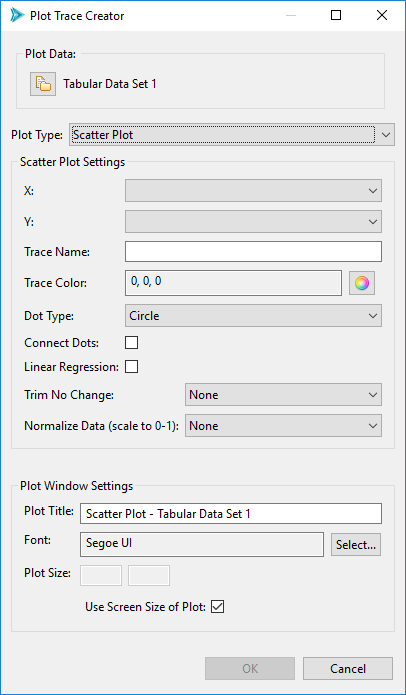

Use this option to create a standard 2D scatter plot.

* **X/Y** Data for the X and Y dimensions of your scatter plot.  You can choose any combination of Dakota parameters and responses.
 * *Note:* "Time [Time]" is a special option in the X/Y dropdowns which allows you to plot using monotonically increasing timesteps.
* **Trace Name** A custom label for your data trace.  The trace label does not get displayed as part of the final plot, but it's a good idea to give your traces memorable names in case you need to find them again later.
* **Trace Color** The color of your plot points.
* **Dot Type**  The shape of your plot points.  The default plotting library (plotly.js) provides dozens of shapes you can use.
* **Connect Dots**  Select this checkbox to connect the points of your trace with a line.
* **Linear Regression** Select this checkbox to draw a linear regression line through your data set.
* **Trim No Change** Omits areas of your data where nothing changed (either along the X or Y axis).  This is a useful feature if you want your trace to only show areas of change.
* **Normalize Data** Scale your data to fit between 0 and 1 (either along the X or Y axis)

## Scatter Plots (Categorical Axes)

<a name="plot-trace-scatter-2d-categorical"></a>


*Note:* Scatter plots with categorical data require plot datasets that have **two** data label axes.

Use this option if you want the independent axis of your scatter plot to come from a categorical dataset with discrete state entries.  This type of plot is best used in conjunction with [Dakota-generated HDF5 files, with the source of the discrete state set provided.](#dakota-hdf-discrete-state-set-name)

* **Data** The data element to use as the *dependent variable* for your bar chart.  *Independent variables* are gathered from the specified discrete data set.
* **Orientation** Determines whether the discrete state set is oriented along the vertical or horizontal axis.
* **Connect Dots** Whether or not the discrete states of your scatter plot should appear as a connected line.  Depending on what you are trying to convey with the scatter plot, a connecting line could be misleading, since there may be no interpolated data between the discrete states.
* **Trace Color** The color of your scatter plot.

## Scatter 3D Plot

<a name="plot-trace-scatter-3d"></a>


Use this option to create a standard 3D scatter plot.

* **X/Y/Z** Data for the X, Y, and Z dimensions of your scatter plot.  You can choose any combination of Dakota parameters and responses.
 * *Note:* "Time Step [Time Step]" is a special option in the X/Y dropdowns which allows you to plot using monotonically increasing timesteps.
* **Trace Name** A custom label for your data trace.  The trace label does not get displayed as part of the final plot, but it's a good idea to give your traces memorable names in case you need to find them again later.
* **Dot Type**  The shape of your plot points.  The default plotting library (plotly.js) provides dozens of shapes you can use.
* **Connect Dots**  Select this checkbox to connect the points of your trace with a line.
* **Color Scale Settings** Specify a [color scale](#color-scales) for your surface plot.  Use the wizard icon to choose from a library of recommended color scales.
 * 3D scatter plots have an extra "Color Axis" field that dictates which dimension of data the color scale should be applied to.  Typically, the color scale is associated with the Z axis for 3D plots (in order to better indicate a sense of depth), but you may reassign the color scale to a different axis.  For example, assigning Color Axis to "Time Step [Time Step]" will present a plot where the color scale indicates the temporal order in which the points were evaluated.

## Surface 3D Plot

<a name="plot-trace-surface-3d"></a>

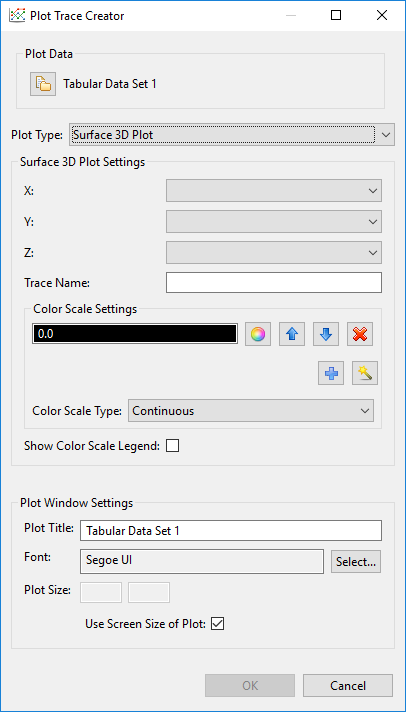

Use this option to create a 3D surface plot.

* **X/Y/Z** Data for the X, Y, and Z dimensions of your surface curve.  You can choose any combination of Dakota parameters and responses, but there must be enough data to create the curve.  For instance, Dakota multidimensional parameter studies are ideal for creating surface curves, but not all Dakota studies provide enough data to determine the shape of the curve.
* **Trace Name** A custom label for your data trace.  The trace label does not get displayed as part of the final plot, but it's a good idea to give your traces memorable names in case you need to find them again later.
* **Color Scale Settings** Specify a [color scale](#color-scales) for your surface plot.  Use the wizard icon to choose from a library of recommended color scales.
* **Show Color Scale Legend** Determines whether or not a color scale legend is displayed on the right-hand side of your plot.
