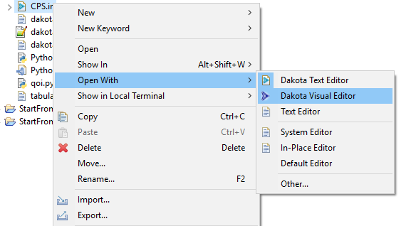
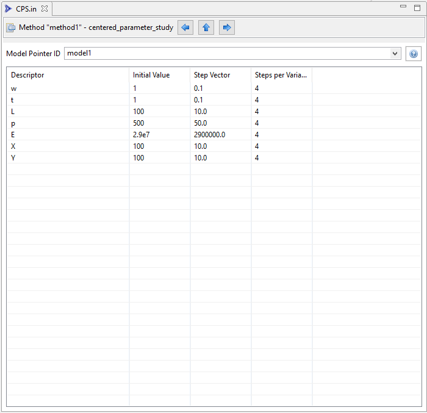
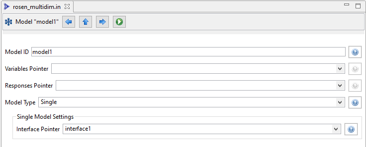
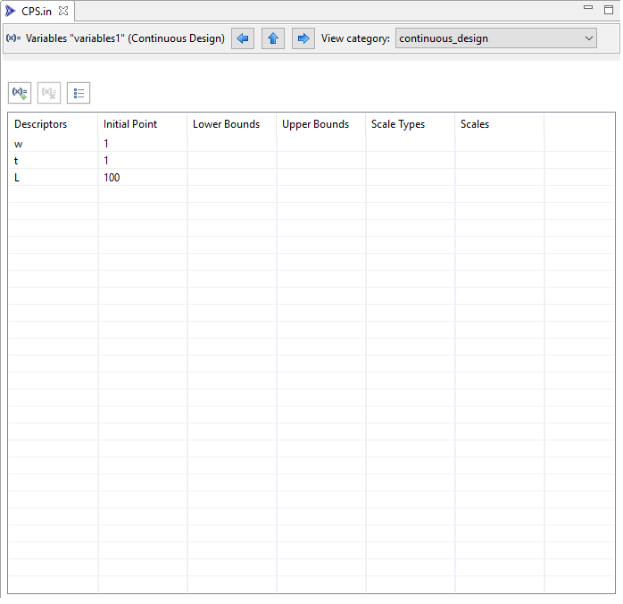
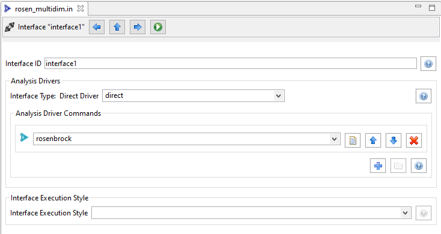
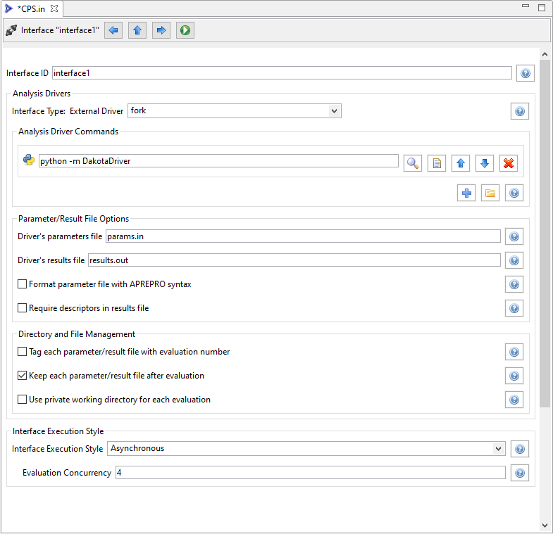
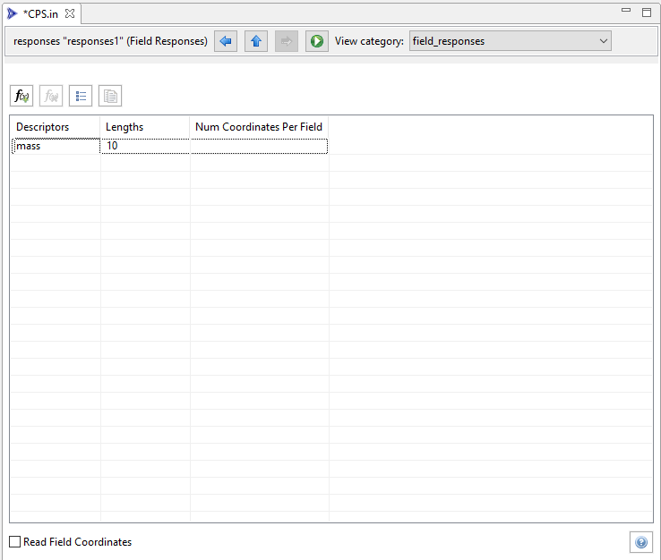
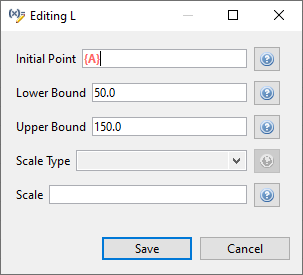

```{eval-rst}
.. _gui-visual-editor-main:
```

The Dakota Visual Editor
========================

## Introduction<a name="introduction"></a>

The Dakota Visual Editor is a powerful alternative to editing Dakota input files in a text editor.  Gone are the days of manually tinkering with long number arrays, or hoping that variables and responses are active and indexed correctly.

If the Dakota Visual Editor is not configured as your default editor of Dakota input files, right-click a Dakota input file and choose "Open With > Dakota Visual Editor".  Otherwise, simply double-click the file.



## The Top Level<a name="top-level"></a>

When first opened, the Dakota Visual Editor shows you the top level of a Dakota input file:


The hiearchical relationship of Dakota blocks is made explicit through indentation.  Clicking on any Dakota block will take you to the editor for that block.

After diving into a specific Dakota block, the action bar along the top of the editor will update:


The left and right arrow buttons will allow you to traverse to the previous or next Dakota block in the input file, respectively.  The up arrow will allow you to return to the top of the Dakota input file.

Also note the green play button in the action bar.  This will allow you to run the Dakota study right away, using an auto-generated [run configuration](DakotaRunConfigurations.html) with default settings.

Finally, note that there are "?" buttons throughout the editors for specific Dakota blocks (typically to the far-right of an individual editor control).  The "?" button will take you to the appropriate page in the Dakota Reference Manual for that keyword.

When you are done making changes to the Dakota input file, simply save the file as you would with any other text editor.

## Environment Blocks<a name="environment"></a>

Here is an example of a Dakota environment block in the Dakota Visual Editor.


## Method Blocks<a name="method"></a>

Dakota has a multitude of method types, so we can't cover all of them in this manual.  But we will take a look at one method editor that clearly demonstrates the benefits of using the Dakota Visual Editor:  centered parameter studies.

Classically, a method block specifying *centered\_parameter\_study* would be written as follows in a Dakota input file:


The *step\_vector* keyword is followed by a series of values, where each value relates to the variable that is in that same index in the variables block.  Likewise for the *steps\_per\_variable* keyword.

For seven variables (as shown here), it is somewhat trivial (though not completely error-proof) to glance up and down between the method block and the variables block to determine which number goes with which variable.  But as the number of variables increases, this manual verification process becomes more and more error-prone.

Worse still, if there is a specification of [active variables](https://dakota.sandia.gov//sites/default/files/docs/latest_release/html-ref/variables-active.html) for this Dakota study (that is, some variables are inactive), the index in the method block corresponds to the index from the list of active variables, NOT the full list of all variables from the variables block.  In short, visually determining which method keyword value corresponds to what variable becomes much harder for active variable sets.

All of this is handled for us if we use the centered parameter study editor provided by the Dakota Visual Editor:



There is now no longer a need to keep track of values by index.  The step vector values and steps-per-variable values are visually associated with the proper variable, simply by being on the same row of the table.  Also, each variable's initial value is provided as well, to give additional context that can inform analysts what to choose for the step vector and steps-per-variable columns.

*Note:* Not all Dakota methods are supported with custom editors.  However, the Dakota team is working to add more and more custom method editor support with each release.  As of version 6.15.0 of Dakota GUI, the following methods are supported with custom method editors:

* centered\_parameter\_study
* coliny\_ea
* hybrid
* list\_parameter\_study
* multidim\_parameter\_study
* multilevel\_sampling
* optpp\_cg
* optpp\_q\_newton
* optpp\_fd\_newton
* optpp\_g\_newton
* optpp\_newton
* optpp\_pds
* sampling
* soga
* vector\_parameter\_study

## Model Blocks<a name="model"></a>

Here is an example of a model block in the Dakota Visual Editor.



## Variable Blocks<a name="variables"></a>

The editor for a variables block is slightly more involved and warrants some additional explanation.


* **Variables ID** This field controls the ID of your variables block.
* **Table Button Bar** There's a horizontal row across the top of the variable table that allows you to manipulate table data.
 * **Add New Variable** Adds a new variable to your variable block.
 * **Edit Variable** Edits the properties of the currently selected variable.
 * **Remove Variable** Removes the currently selected variable from the block.
 * **Variable Ordering within Category** Dakota variables are ordered first by *variable category* (sometimes referred to as "spec order"), and then by user-customized ordering within that category.  This button allows you to configure the latter.
 * **Auto-Visualize Variable** For variable types that have an uncertainty/probability functions associated with them, this button allows you to visualize the curve (according to the properties set for this variable) in the [Chartreuse Sandbox View](ChartreuseSandbox.html).
 * **Open Dakota Reference Manual for Variable Category** For the currently selected variable's category, open the appropriate page in the Dakota Reference Manual.
 * **Active variables dropdown** Allows you to manually specify the active variable set of this Dakota variables block.  [Refer to the variables section of the Dakota Reference Manual for more information on active variables](https://dakota.sandia.gov//sites/default/files/docs/latest_release/html-ref/variables.html).
 * **Variable Domain** Located below the table, this dropdown allows you to manually specify a "[mixed](https://dakota.sandia.gov//sites/default/files/docs/latest_release/html-ref/variables-mixed.html)" or "[relaxed](https://dakota.sandia.gov//sites/default/files/docs/latest_release/html-ref/variables-relaxed.html)" domain for this variables block.

Within the table, the columns are as follows (from left to right):

* **(Active)** If the variable is active according to the overall specification of this Dakota input file, a lit-up lightbulb icon will be displayed; otherwise, the lightbulb icon will appear dimmed.  It is not possible to directly change the active/inactive state of a variable.  [Refer to the variables section of the Dakota Reference Manual for more information on active variables](https://dakota.sandia.gov//sites/default/files/docs/latest_release/html-ref/variables.html).
* **#** The Dakota spec order for this variable.  Dakota variables are ordered first by *variable category* and then by user-customized ordering within that category.
* **Variable** The name (or "descriptor") of the variable.
* **Category** The category that this variable belongs to.  Changing the category will automatically cause a reordering of Dakota variables based on the new category position of this variable.

**Variable Properties Dialog**

Once a variable has been assigned to a category (such as *continuous\_design*), you can access that variable category's properties.  Click on the variable in the table, then click on the Edit Variable button (the second button from the left).


A new dialog will pop up that allows you to edit each possible property for that variable category.  Help buttons are provided for each property so that you can read up on what each one does.

**View Variable Table by Category**

Along the top action bar of the Dakota Visual Editor, you may also notice a "View category" dropdown.  This allows you to dive into viewing the properties of a single variable category:



Note that we are still in the same variables block, but the view has changed.  In this screenshot, we're only viewing continuous design variables.  The other continuous state variables in this example have been hidden from view.  In addition, the properties of those continuous design variables have been exposed as table columns.  From this view, if you want to edit the properties of an individual variable, you no longer have to push the "Edit" button along the top of the table - you can simply directly edit the property using the table.

## Interface Blocks<a name="interface"></a>

The editor for an interface block affords you a lot of additional functionality beyond editing hierarchically stacked keywords.



Now let's look at a more complex example:



## Response Blocks<a name="responses"></a>


* **Responses ID** This field controls the ID of your responses block.
* **Response Type** Choose the type of response for this responses block.
* **Gradient** Choose the type of gradient for this responses block.
* **Hessians** Choose the type of hessian for this responses block.
* **Table Button Bar** There's a horizontal row across the top of the response table that allows you to manipulate table data.
 * **Add New Response** Adds a new response to this responses block.
 * **Edit Response** Edits the properties of the currently selected response.
 * **Remove Response** Removes the currently selected response from the block.
 * **Response Ordering within Category** Dakota responses are ordered first by *response category* (either "scalar" or "field" within the specified type of response), and then by user-customized ordering within that category.  This button allows you to configure the latter.
 * **Open Dakota Reference Manual** For the currently selected responses's category, open the appropriate page in the Dakota Reference Manual.

Within the table, the columns are as follows (from left to right):

* **#** The Dakota spec order for this response.  Dakota variables are ordered first by *response category* and then by user-customized ordering within that category.
* **Response** The name (or "descriptor") of the response.
* **Category** The category that this response belongs to.  Changing the category will automatically cause a reordering of Dakota responses based on the new category position of this response.

**Response Properties Dialog**

Some (but not all) responses have properties, similar to variables.  Whether a response has properties is indicated by the enablement of the "Edit Response" button after clicking on a response.  To access a response's properties, click on the response in the table, then click on the Edit Response button (the second button from the left).


A new dialog will pop up that allows you to edit each possible property for that response category.  Help buttons are provided for each property so that you can read up on what each one does.

**View Response Table by Category**

Along the top action bar of the Dakota Visual Editor, you may also notice a "View category" dropdown.  This allows you to dive into viewing the properties of a single response category:



Note that we are still in the same response block, but the view has changed.  In this screenshot, we're only viewing field responses.  The other scalar responses in this example have been hidden from view.  In addition, the properties of those field responses have been exposed as table columns.  From this view, if you want to edit the properties of an individual response, you no longer have to push the "Edit" button along the top of the table - you can simply directly edit the property using the table.

## Using Pre-processor Markup<a name="markup"></a>

To replace a value in a Dakota study with pre-processing markup (i.e. curly brace syntax), use the hotkey combination **Ctrl+Shift+P** (P for "parameterize").  The value's text will turn orange and bold, and curly braces will automatically be added around the existing text for you.  You can now put whatever you like between the curly braces to indicate the name of your pre-processing variable:



To return the field to its normal text entry mode, simply use **Ctrl+Shift+P** again to deactivate the pre-processor syntax.

The Dakota Visual Editor supports pre-processing markup in a few select areas:

* Single-line text entry fields
* Property editor dialogs
* Table cells for method, variables, and responses blocks

Finally, be aware that a Dakota study marked up with pre-processor syntax will not run by itself in the absence of more information.  You must call Dakota with information about how to pre-process the file (for example, Dakota's command-line **-preproc** flag).

Learn more about Dakota's pre-processing tools in [Section 10.8 of the Dakota User's Manual](https://dakota.sandia.gov/content/manuals). 