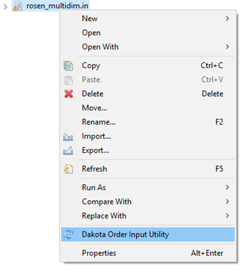
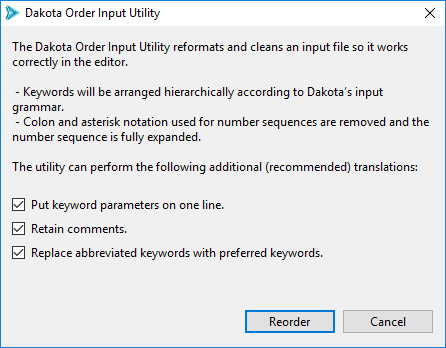
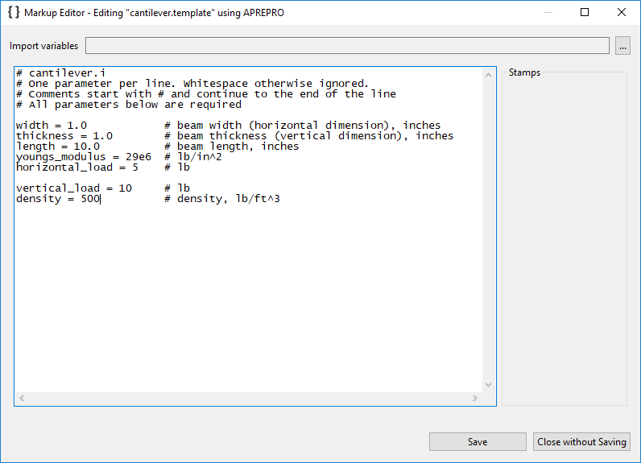
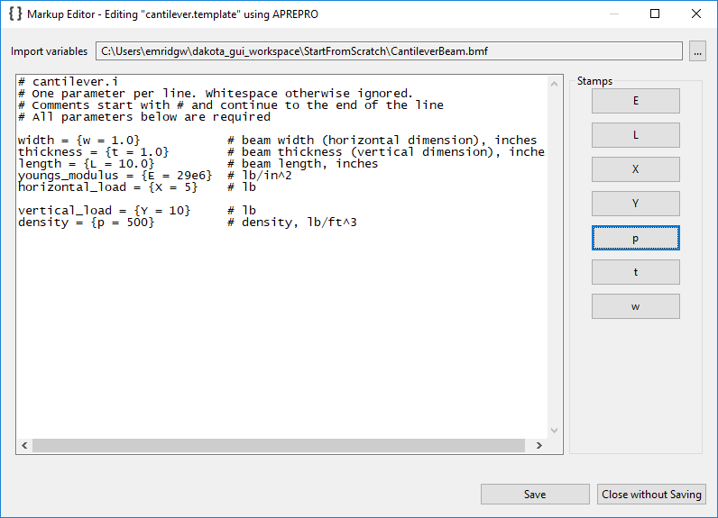
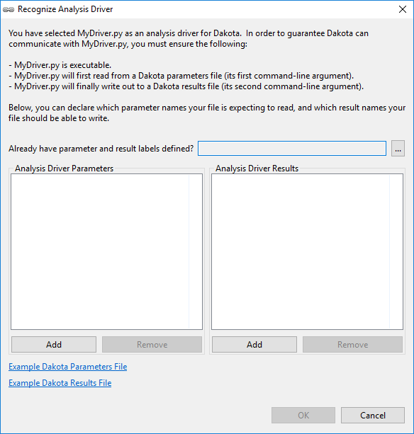

```{eval-rst}
.. _gui-context-tools-main:
```

Context Menu Tools
==================

## Dakota Order Input Utility

<a name="dakota-order-input-utility"></a>

If you have imported an old Dakota input file that used to work, but now has syntax errors, you may want to try applying the Dakota Order Input Utility on it.  This utility attempts to reorganize your input file according to current Dakota language standards.

To access the Order Input Utility, right-click on a Dakota input file and select "Dakota Order Input Utility."






## Markup File

<a name="markup-file"></a>

### Introduction to Markup

Commonly, black-box simulation models receive text files as their input.  The process of communicating between Dakota and the external black-box simulation models is often made easier if we can apply markup to the simulation model's text input file.  "Markup" typically refers to defining variables using a delimiter (such as surrounding curly braces).

Once markup has been applied to the input file, your Dakota analysis driver can apply a pre-processing tool (such as APREPRO or DPREPRO) to the marked-up file, which replaces the markup syntax with the latest variable values from the current Dakota iteration.

**Recommended Further Reading**

* Learn more about the [process by which Dakota communicates with external simulation models](ExternalSimulationModelOverview.html).
* Learn about the [APREPRO](https://gsjaardema.github.io/seacas/aprepro.pdf) pre-processing tool.
* Learn about the DPREPRO pre-processing tool (a Dakota-developed derivation of APREPRO with similar syntax) in [Section 10.8 of the Dakota User's Manual](https://dakota.sandia.gov/content/manuals).
* Configure Dakota GUI's default pre-processing markup style in the [Preferences](Preferences.html) dialog.

### "Markup File" Tool

If you have a text file that you'd like to apply pre-processing markup to, right-click on that file and choose "Markup file" from the context menu.




At this stage, you may wish to manually apply your favorite pre-processing markup style to the file contents by editing directly into the text window.  If you have another file that has input parameters already defined (for instance, a [BMF file](BMF.html)), use the "Import variables" file importer to populate this dialog with information about what variable labels to use for pre-processing:


Observe that the "Stamps" group on the right side has been populated with buttons representing our variable labels.  To use these stamp buttons, simply highlight the portion of text in the text window that you want to replace, and click the appropriate stamp button to replace it.

*Note:* Pre-processing markup style is defined in the Highlighter section of the [Preferences dialog](Preferences.html#highlighter).

When you're done, your marked-up file may look something like this.



## Recognize as Analysis Driver

<a name="using-an-existing-script-file-as-a-driver"></a>

Suppose you already have a script file you want to use as an analysis driver.  You’ve imported it into your workspace, but wizards (like the New Dakota Study wizard) don’t recognize it as a valid analysis driver.  That is because the Dakota GUI depends on a concept known as an **interface manifest** to enforce a handshake between Dakota and its analysis drivers.  The interface manifest is simply a file that declares what input parameters a given analysis driver expects to receive, and what output results it can produce.

To make an interface manifest for arbitrary script files, simply right-click on the file in the Project Explorer and choose “Recognize as Dakota Analysis Driver.”


As of version 6.15.0, Dakota GUI observes the following extensions as candidates for analysis driver recognition: .py, .bat, .sh, .csh, .java, .perl, .pl, .ps1, and .vbs.

When you choose this option, the following dialog will appear:



This dialog allows you to define an interface manifest for your analysis driver.  Use the “Add” and “Remove” buttons to create parameter and result labels.  Or, use the file selector labeled “Already have parameter and result labels defined?” to import parameter and response labels from another source (such as a [BMF file](BMF.html), an [IWF file](NextGenWorkflow.html), or even a pre-existing Dakota study).

When you’re done, the dialog should look something like the following:


Click OK to create the interface manifest (.im) file for your script.  Your arbitrary script is now compatible with the rest of Dakota GUI.  