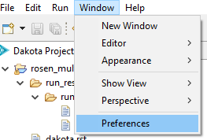
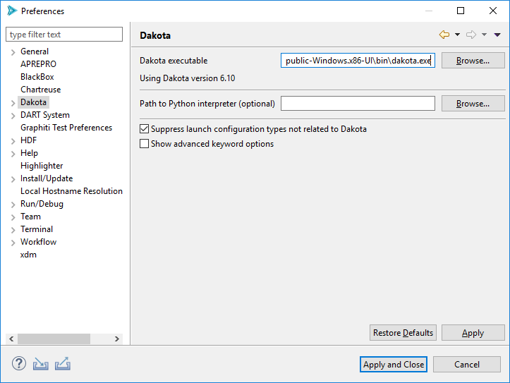
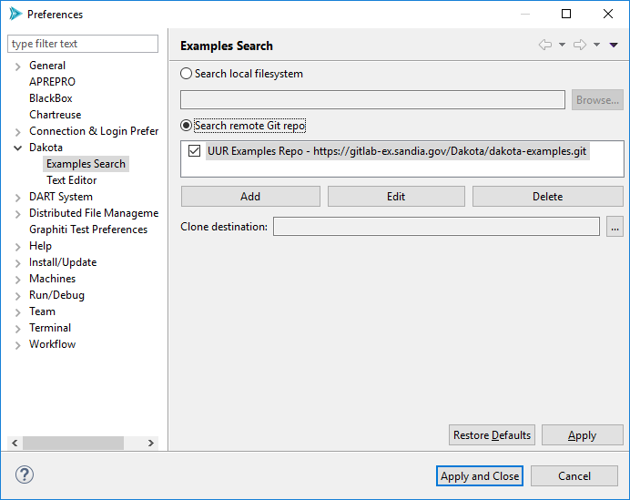
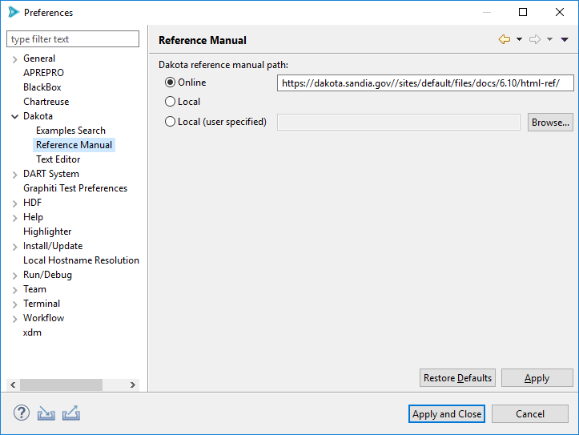
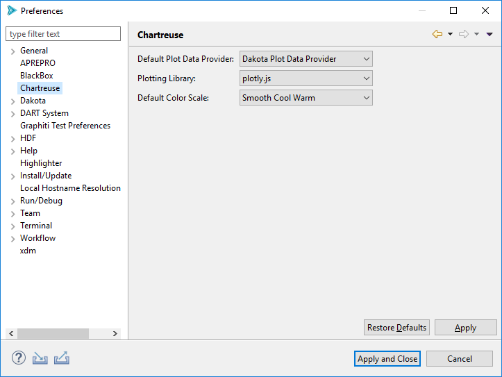
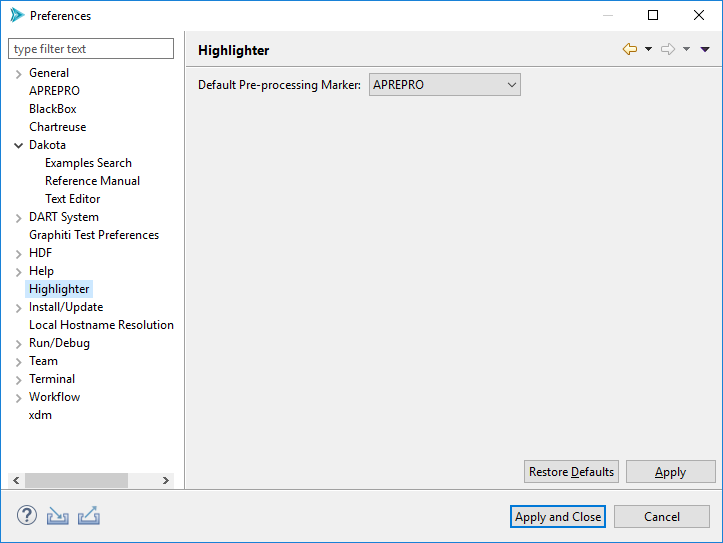

```{eval-rst}
.. _gui-preferences-main:
```

Preferences
===========

## Introduction

<a name="introduction"></a>

The Dakota GUI's main area for basic, global configurations can be found under Window > Preferences.

*Note:* On Mac, this option is located under Dakota GUI > Preferences.



## Dakota

<a name="dakota"></a>



* **Dakota executable** The path to the Dakota executable.
 * *Note:* If the GUI can't automatically detect the location of your Dakota executable, this field will be blank and need to be manually configured the first time you use the GUI.
* **Path to Python interpreter (optional)** You can manually provide your own path to a Python interpreter.  If provided, this Python interpreter will be used by any Python-based driver scripts, overriding any other Python interpreters on your system path.
* **Suppress launch configurations** If this option is checked, Dakota GUI will hide [launch configuration types unrelated to running Dakota](DakotaRunConfigurations.html).
* **Show advanced keyword options** If checked, all Dakota keyword options will be presented in the [Dakota Visual Editor](DakotaInputFiles.html#dakota-visual-editor).  Otherwise, less common keywords will be hidden.

## Dakota > Examples Search

<a name="dakota-examples-search"></a>



* Set the top-level radio button to "Search local filesystem" to cause the Dakota Examples Search dialog [to look for examples within the Dakota install directory](DakotaExamples.html#offline-examples-search).
* Set the top-level radio button to "Search remote Git repo" to cause the Dakota Examples Search dialog [to look online for Dakota examples](DakotaExamples.html#online-examples-search).

### Remote Git Repo Configuration

Note that you can configure Dakota GUI to clone examples from not one but many repos.  To import from an online Git repo directly into your workspace, you must first tell the Dakota GUI which repo you want to clone from, as well as provide credentials if necessary.

To add a new repository, click "Add."


Provide the URL for your Git repo, as well as an optional name for your repo (to make it easier to find later, if you are cloning from a multitude of repos).

Then, choose HTTPS or SSH for your chosen protocol.  If you choose HTTPS, you can provide your Git username.  If you choose SSH, you can provide your public and private key files.

Check the "Access repo anonymously" button if you know your repository allows anonymous access, and you don’t want to be pestered with authentication pop-up dialogs.

When finished, click OK.

Back on the main Preferences dialog, if you wish to control the location on disk where your examples will initially be cloned, use the "Clone destination" file selection control to provide a file path.  Otherwise, the Git repos will be cloned to a random temporary directory on your machine, which will get deleted by your operating system after enough time has passed.

When finished, click "Apply and Close."

## Dakota > Reference Manual

<a name="dakota-reference-manual"></a>



* **Dakota reference manual path** Configure where the Dakota GUI will look for the Dakota reference manual.  By default, [the online version of the Dakota reference manual](https://dakota.sandia.gov/content/611-reference-manual) is used, but you can also switch to a local version of the reference manual if you are working without an Internet connection.

## Chartreuse

<a name="chartreuse"></a>



* **Default Plot Data Provider** If a file containing plottable content (for instance, Dakota tabular data files) is selected for graphical plotting, but Dakota GUI cannot make a determination about how to interpret it, this field determines the default plot data provider to use.
* **Plotting Library** This setting allows you to control which underlying plotting library is used to render graphical plots.
* **Default Color Scale** This setting allows you to decide which color scale is used by default for plots requiring a color scale (for instance, heatmaps).
 * See ["Color Map Advice for Scientific Visualization" by Kenneth Moreland](https://http://www.kennethmoreland.com/color-advice/).

## Highlighter

<a name="highlighter"></a>



* **Default Pre-processing Marker** This setting controls what pre-processor markup type is used by default.
 * **APREPRO** APREPRO is an algebraic pre-processor that reads a file containing both general text and algebraic, string, or conditional expressions.  [You can learn more about APREPRO at this link.](https://gsjaardema.github.io/seacas/aprepro.pdf)
 * **DPREPRO** DPREPRO is a Dakota-developed derivation of APREPRO with similar syntax. [You can learn more about DPREPRO in Section 10.8 of the Dakota User's Manual.](https://dakota.sandia.gov/content/manuals)
 * **Positional Preprocessor** A special type of pre-processor used by Dakota GUI.  Rather than marking up a text file, a positional pre-processor is an in-memory instruction that replaces a range of text characters at runtime.