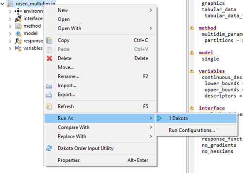
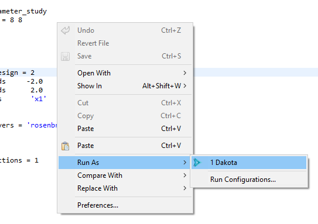
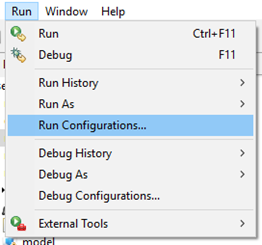
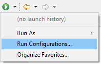
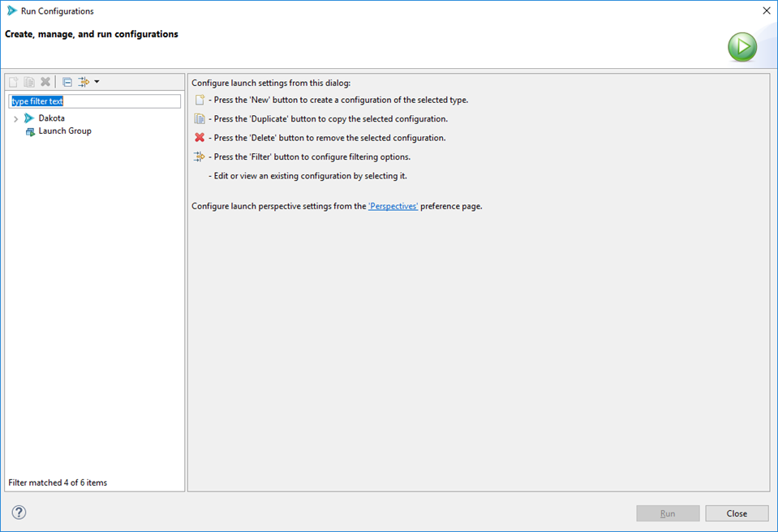
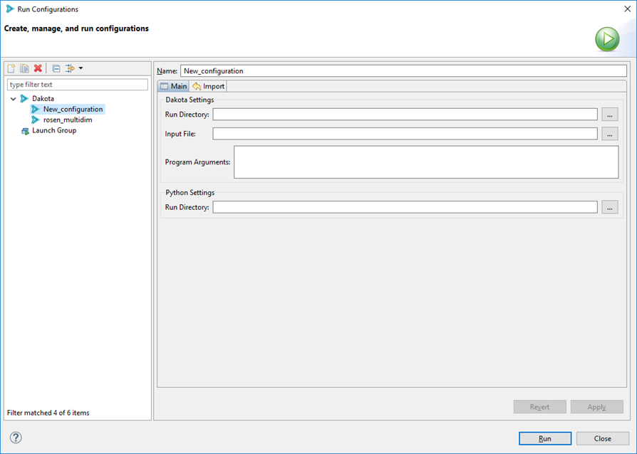
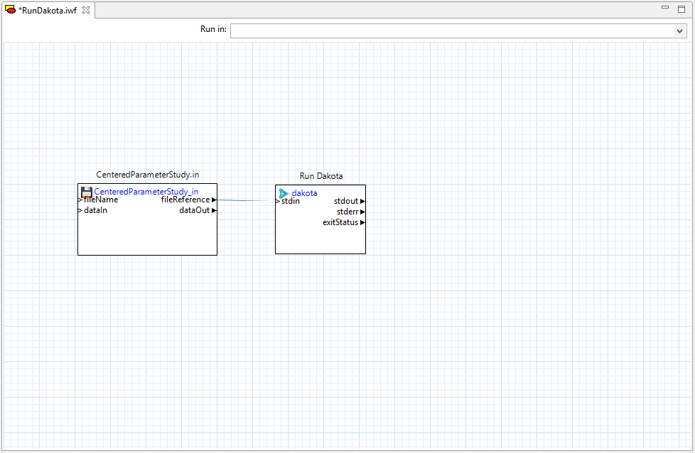

Dakota Run Configurations
=========================

## Run Dakota Using the Eclipse Run Configuration Framework

 Creating a run configuration to run Dakota is a straightforward process for most cases, and is designed to save you lots of time in the future.

### Quick Start

 To immediately run a Dakota input file with reasonable default settings, right-click on your Dakota study, then select Run As > Dakota.

Or, you can right-click on the Dakota study itself in the text editor and choose Run As > Dakota.

In the background, a new run configuration will automatically be created for you with the following defaults:

* The run configuration's input file will be the one you selected.
* The run configuration's run directory will be the parent directory of the input file.
* All possible Dakota output files will be backed up in a time-stamped directory in your project.

### The Run Configurations Dialog

The Run Configurations dialog provides information about past run configurations, and also gives you the controls to make new run configurations.  To access the Run Configurations dialog, select Run > Run Configurations from the top menu.

...or select the small down arrow next to the Run icon and select Run Configurations.

(If these options are not available, turn them on by going to Window > Perspective > Customize Perspective.  Then, select the Action Set Availability tab and make sure "Launch" is checked underneath the "Available action sets" column.)

Here, you can specify a configuration for running Dakota.  Creating a run configuration only needs to be done once (at minimum) to run a Dakota input file.  After creating the run configuration, you can run Dakota again using the same configuration by pushing one button.  Also, you can make as many run configurations as you want.

To begin, double-click on the Dakota line in the list on the left.

### Dakota Run Configuration options

**Name** The name of your run configuration.  This can be whatever you want.

**Main Tab**

* **Run Directory** The directory in which Dakota will run.  This can be anywhere on your filesystem.
* **Input File** The Dakota input file to run.  This field is usually auto-populated for you if you use the [Run shortcut in the context menu](#run-shortcuts), but if it's not, use the file browser button to get the input file you want to run.
* **Program Arguments**  Any additional command-line arguments you would like to pass to Dakota.  If you run "dakota -help" on the command line outside of the GUI, Dakota will give you a list of all possible command line arguments.

**Import Tab**

When Dakota is finished running, the GUI can automatically copy any of Dakota's many output files and store them in a time-stamped directory for future reference.  This is a handy feature if you want to preserve information about every run you do with Dakota.  Otherwise, on subsequent runs of Dakota, unless you specify a different run directory for Dakota, then Dakota will overwrite its previous output files.

* **Parent directory** The name of the directory to back up files to.  The default name is "run_results" but you can choose any name you like.
* **Import checkboxes** Use these checkboxes to specify which of Dakota’s generated files you want to make backup copies of.  For instance, if you don’t want the GUI to backup any output files, you can uncheck all of these boxes.

When you are done configuring your Dakota run configuration, click the Apply button to save your changes.

*Note:* For all Dakota run configurations, the Dakota GUI will use the [globally specified version of Dakota](Preferences.html#dakota) as the target process.

When you are ready to run, click Run in the bottom-right corner of this dialog.

### Run Configuration History

After executing a run configuration, you can easily access it again by clicking the down arrow near the Run icon:

This menu keeps a history of recent previous run configurations.  Simply select the one you want to run – there is no need to open the Run Configurations dialog again unless you want to reconfigure your run configuration.

### Dakota Console Options

Dakota displays its console output in the Console view:

There are some actions available on the Console view:

From left to right:

* **Terminate** Attempts to stop Dakota from running further.  This icon will be grayed out if Dakota is not running.
* **Remove Console** Close the console view.  You can always bring the console back from the list of views (Window > Show View > Other… then select General > Console).
* **Clear Console** Rather than closing the whole console, this action simply clears all of the text and leaves the console open.
* **Scroll Lock** Toggle scroll lock on the console.
* **Word Wrap** Toggle word wrap for the console.
* **Pin Console** Pins the console to the front.  If you have multiple consoles open, pinning keeps the current one in focus.
* **Display Selected Console** Allows you to switch between multiple open consoles.
* **New Console View** Opens a new console.

## Run Dakota Using the Workflow Engine

You can also execute Dakota via the "dakota" node in [Next-Gen Workflow](NextGenWorkflow.html).

The most common use case for this is when you need the "dakota" node to [perform a runtime lookup of a nested IWF file as the proper analysis driver for the Dakota study](Wizards.html#dakota-wrapper-workflow-wizard).