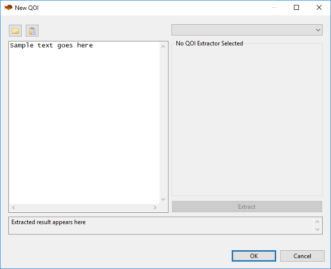
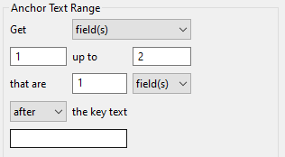
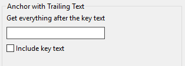
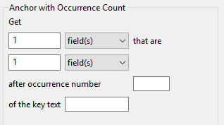
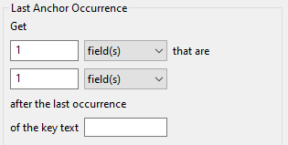
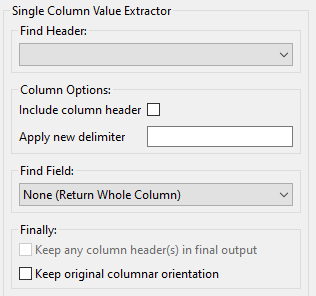
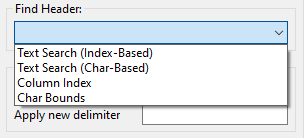
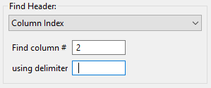
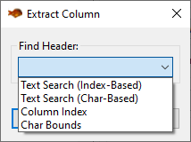
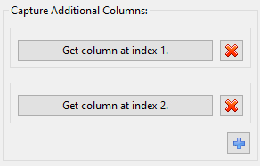

QOI
===

## Introduction

QOI (pronounced "koi") is a tool shipped with the Dakota GUI that is capable of extracting quantities of interest from unstructured text.  This is particularly useful for scraping information from text files without the need to write complex regular expressions.

Most running processes output a stream of text - for instance, a log file, or perhaps console output from the running process.  Generally speaking, this text output can vary - the body of text could be shorter or longer on any given run, or text could also appear in non-deterministic order, depending on the process.  It's usually not wise to try and extract a quantity of interest from the body of text based on absolute character positioning.  However, quantities of interest will usually occur in the same location in a log file **relative to the surrounding text**.  More often than not, nearby labels (or "key text") that describe our quantities of interest can be used to find the quantities themselves.

**Example**

For instance, you might expect the following text to appear somewhere in your process output:

	MASS = 0.001

If you wanted to extract the "0.001" value shown above, you'd only need to know about the location of the "MASS" label preceding the value, and you could deduce the location of the value, provided we make some simple assumptions about the relationship between "MASS" and "0.001" (for instance, that an equals sign appears between the two words).

There are many different types of QOI extractors you can use, thanks to the "New QOI" dialog.

## Using the New QOI Dialog

Currently, the QOI dialog can be accessed in two places:

* [The New Script-Based Dakota Driver wizard, on the post-processing page.](Wizards.html#script-based-dakota-driver-wizard)
* [In Next-Gen Workflow, via the qoiExtractor node.](#NextGenWorkflow.html)

In both cases, to open the "New QOI" dialog, simply click on "Add QOI Extractor" and provide a name for your new QOI extractor.  You will then be presented with the "New QOI" dialog.

The general idea behind this dialog is to import a blob of unstructured text into the area on the left, and then apply a QOI extractor to that text.  You may need to experiment with several QOI extractors until you find an extractor that does what you want it to do.

On the left side of the dialog...

* **Open File (the folder button)** This allows you to import a text file (for example, a saved log file) into the sample text area.
* **Paste (the clipboard button)** If you have text on the clipboard, click this button to paste it into the sample text area.
* **Sample Text Area** This is where you place your example unstructured text to guide you in defining a QOI extractor.  Think of it as a sandbox for trying out different QOI extractors. 

On the right side of the dialog...

* **QOI Extractor Dropdown** This dropdown contains all QOI extractors available for you to use.  The following sections on this manual page describe each QOI extractor in detail.
* **Extract** Click this button to apply your configured QOI extractor to the unstructured text in the sample text area.
* **"Extracted result appears here" text box** Like the default text here implies, after you click the "Extract" button to apply your configured QOI extractor, the resulting extracted QOI appears here.  This gives you immediate feedback as to whether your QOI extractor is doing what you want it to do.

## Anchor Text

"Anchor Text" is the most straightforward type of QOI extractor.  If your QOI is near an anchoring piece of text (or "key text") use the fields in this group to define the distance between the anchor text and the QOI.  The fields shown here are laid out like a spoken sentence to help you conceptualize what the QOI extractor will do.

For example, let's take a look at a snippet from the log file that Dakota's classic cantilever beam simulation will output when run:

	--------------------------------------------------------------------------------
	Output Section: MASS
	Based on user inputs, estimated cantilever beam mass is:
    	2.89351852e+01 (lb)

Let's say "2.89351852e+01" is the QOI we're interested in.  This number value relates to the mass of the cantilever beam - we know that because the text "MASS" appears two lines before the QOI.  Therefore, "MASS" should be our key text.  Because "MASS" and "2.89351852e+01" are separated by two lines, our Anchor Text QOI extractor expression should read as follows:

	Get 1 field(s) that are 2 line(s) after the key text MASS

This is the most straightforward way to get the value.  But there's more than one way to skin this cat.  You could also set the following expression:

	Get 1 field(s) that are 10 field(s) after the key text MASS

This works because "2.89351852e+01" is the tenth word (or "field") after "MASS".  This approach is not as preferable to the first one, because it's not as intuitive.  However, something like this would be required if there were no line breaks between "MASS" and "2.89351852e+01".

## Anchor Text Range

The "Anchor Text Range" QOI extractor builds on the concepts of the "Anchor Text" QOI extractor, providing a more flexible method for extracting a range of quantities in relation to the position of key text.

Let's consider the following example:

	--------------------------------------------------------------------------------
	RESULT:
	The quick brown fox jumps over the lazy dog.
    --------------------------------------------------------------------------------

Let's assume that the quantity of interest is the text "lazy dog", and our key text should be the word "RESULT".  Using the plain "Anchor Text" QOI extractor, we would only be able to extract one of these words.  However, "Anchor Range" will allow us to extract all the desired words:

	Get fields 8 up to 10 that are 1 line(s) after the key text RESULT:

This statement says that we want the fields between 8 and 10 (inclusive and exclusive, respectively).  "Lazy" is the eighth word on this line, and "dog" is the ninth.  The tenth field would be the next line of hyphens, but this extractor only goes *up to* field 10 and doesn't include it. 

## Anchor Text with Leading Text

"Anchor Text with Leading Text" allows you to bifurcate a body of text around an anchor (or "key text").  Using the anchor, you can preserve everything that precedes the anchor, and throw away everything that follows.

This type of QOI extractor can be extremely useful in conjunction with a [workflow built in Next-Gen Workflow](NextGenWorkflow.html), by chaining multiple qoiExtractor nodes together.  For example, the first qoiExtractor node could use "Anchor Text with Leading Text" to downsize a log file to a relevant portion; then subsequent qoiExtractor nodes can operate on the smaller subsection of the log file.

## Anchor Text with Trailing Text

"Anchor Text with Trailing Text" allows you to bifurcate a body of text around an anchor (or "key text").  Using the anchor, you can preserve everything that follows the anchor, and throw away everything that precedes it.

This type of QOI extractor can be extremely useful in conjunction with a [workflow built in Next-Gen Workflow](NextGenWorkflow.html), by chaining multiple qoiExtractor nodes together.  For example, the first qoiExtractor node could use "Anchor Text with Trailing Text" to downsize a log file to a relevant portion; then subsequent qoiExtractor nodes can operate on the smaller subsection of the log file.

## Anchor Text with Occurrence Count

"Anchor Text with Occurrence Count" works the same as "Anchor Text", but accounts for the possibility that your key text appears in the unstructured text more than once, and that you may not want the first occurrence of the key text.

For example, let's take a look at a snippet from the log file that Dakota's classic cantilever beam simulation will output when run:

	--------------------------------------------------------------------------------
	Output Section: MASS
	Based on user inputs, estimated cantilever beam mass is:
    	2.89351852e+01 (lb)

Let's pretend that "MASS" appears four times prior to this text snippet; therefore, this snippet of text is the fifth occurrence of "MASS", which is the one we're interested in.  To get it using "Anchor Text with Occurrence Count", you would write:

	Get 1 field(s) that are 2 line(s) after occurrence number 5 of the key text MASS

## Last Anchor Occurrence

"Last Anchor Occurrence" works similarly to "Anchor Text with Occurrence Count", but rather than counting occurrences of a key text phrase, this QOI extractor will find the last occurrence of the key text in the whole body of text, and then extract the QOI from there.

## Single Column Value Extractor

The "Single Column Value Extractor" assumes columnar data within your body of text, and allows you to traverse columns vertically.  For example, this extractor could be used to traverse a CSV file; it could also be used to traverse a Dakota tabular file.

This QOI extractor is quite flexible, but all its options can be overwhelming at first.  We'll go through each configuration option one by one.

*Pro Tip:  It is recommended to make frequent use of this dialog's "Extract" button as you go along, to ensure that you are extracting what you expect at each stage of the process.*

### Step 1.  Find Header

The first thing this QOI extractor must do is find the header of your column. This can either be an explicit header row that contains a label for the data, or it can be an implied starting point for your column if no header row is provided.

**Text Search (Index-Based)** Use this option to search for a text header label, assuming that your columns respect distinct indices defined by a delimiter.  For example:

	---------------------------------------
	Column1    Column2    Column3   Column4
	1.0        2.0        3.0       4.0
	5.0        6.0        7.0       8.0
	9.0        10.0       11.0      12.0

Let's say we want to extract "Column2."  After selecting "Text Search (Index-Based)" from the dropdown, the following controls appear:

 options")

We suppply "Column2" for the header text and a space for the delimiter.

**Text Search (Char-Based)** This option is similar to the previous index-based option, but a char-based header looks at the start character position and end character position of your column header.  As such, all subsequent values extracted beneath the column header will be extracted based on the same start character position and end character position.  This is useful if your columnar data is not uniformly formatted with consistent delimiters.  For example:

	----------------------------------------
	Column1    Column2    Column3   Column4 
	a b        2.0        3.0       4.0
	c d        6.0        7.0       8.0
	e f        10.0       11.0      12.0

In Column1, each "field" contains a space in the middle, but spaces are also used to delimit the columns.  The presence of spaces in the first column will throw off our index count if we were to use the "Text Search (Index-Based)" option.  As such, we must resort to the "Text Search (Char-Based)" option.

 options")

With this setting, the QOI extractor will extract all data beneath "Column2", bounded by the start character position and end character position (inclusive) of "Column2."

Another useful feature of this type of column header finder is the ability to include space padding in the "Find header text" entry field.  To illustrate this, take a close look at "Column4."  Because of poor formatting, "12.0" extends one character to the right of the last character position for "Column4."  If we were to provide "Column4" in the "Find header text" field, "12.0" would be truncated to "12."  To get around this, all we need to do is add a space to the "Find header text" to account for the fact that we need to grab more character positions when the column is extracted.

**Text Search (Column Index)**

Assume that your columnar data does not have an explicit row of header labels.  That's ok too.  If your table is well-formatted with consistent delimiters, you can use the "Text Search (Column Index)" option to extract a column:

Note that this field finder option uses a 1-based count for column index, not a 0-based count.

**Char Bounds**

This is the field finder with the most fine-grained control.  With this one, you are expected to provide explicit character start and end positions to define your column.  Use this as a last resort if 1) your columnar data has no header row, and 2) your columnar data is not well-formatted.

### Step 2. Column Options

Let's assume Step 1 was a rousing success, and you have identified the column you want to extract.  At this juncture, you can apply some options to the column in question:

* **Include column header** If a header row exists and is being used to identify the column, check this box if you'd like to keep the header row text as part of the extracted text.
* **Apply new delimiter** Use this field to insert a new delimiter character in between the values of your column, replacing the original column delimiter.

### Step 3.  Find Field

Now, let's assume that you're only interested in a particular value from the column, not the entire column.  The third section of controls provides options for selecting a single value from the column.

* **None (Return Whole Column)** Return the entire column as-is.  This option should be used if you actually do want to keep the entire column.
* **Row Index** Extract a single column value based on its row index (1-based, not 0-based).  An additional control will appear allowing you to specify the row index.
* **Last Row** Extract the last value from the column.
* **Minimum Value** Assuming numerical data, extract the minimum value from the column.
* **Maximum Value** Assuming numerical data, extract the maximum value from the column.
* **Closest Value** Assuming numerical data, extract the value that is closest to a value that you provide.  An additional control will appear allowing you to enter this value.

### Step 4.  Finally

There are a few final options you may want to apply to your extracted quantity of interest.

* **Keep any column header(s) in final output** After reducing the column to a single value of interest, use this option to prepend the column header to the value.  This is useful if you want your text output to appear as a tuple, like "Column1 1.0".  Any new delimiter applied in Step 2 will apply here as well.
* **Keep original columnar orientation** If your final output consists of more than one field (i.e. the entire column is your quantity of interest), use this option to preserve the column's vertical orientation.  If unchecked, the column data will be oriented horizontally onto one line of text, with any previous delimiters still being applied between values.
 
## Multi-Column Tuple Extractor

**Note:** The "Multi-Column Tuple Extractor" builds directly upon the [Single-Column Value Extractor](#column-extractor), so it is recommended that you master that QOI extractor before moving on to this one.

Like the Single-Column Value Extractor, the purpose of this QOI extractor is still focused on extracting a quantity of interest from a single column, but this extractor also allows you to extract *associated values* from other columns in the same table.  As such, this QOI extractor could also be thought of a "table reducer", where the only values that remain are related values of interest from specific columns.

**Example**

Before we get into the controls, let's illustrate with an example.

	-------------------------
	Index   Column1   Column2
    1       100.0     0.0
    2       25.0      100.0
    3       0.0       50.0
    4       75.0      75.0
    5       50.0      25.0

Let's say we are interested in the maximum value from Column2.  Simply looking at the table, we can see that the maximum value occurs at index 2.  But let's say that we also want to preserve the fact that the maximum value occurs on index 2.  Further, let's say that we don't care about Column1 and don't want it in our output.

So, we would want our final output to look something like this:

	Index   Column2
    2       100.0

The Multi-Column Tuple Extractor allows us to export this as our quantity of interest.

Much of the Multi-Column Tuple Extractor is repeated from the Single-Column Value Extractor.  As stated previously, you should fully understand the concepts of the Single-Column Value Extractor before using this one.

### [Step 1.  Find Header](#column-extractor-step-1)
### [Step 2.  Column Options](#column-extractor-step-2)
### [Step 3.  Find Field](#column-extractor-step-3)
### Step 4. Capture Additional Columns

This step is where things deviate from the Single-Column Value Extractor.  Once we have acquired our column of interest, we should specify the other columns we want to extract as part of our quantity of interest.

To begin, click on the blue plus icon.

A new "column-extraction row" will be added to this area of the dialog, with a button reading "Get column with undefined strategy".  This text appears because we haven't told it what column we want to extract.  Click on the button to define the column extraction strategy.

This dialog should remind you of [Step 1](#column-extractor-step-1), where we defined our rule for identifying a single column.  The same principles apply here.  The only difference is that columns defined in this section cannot define their own rules for extracting individual *fields*, since they are dependent on the configuration of the primary column.

When we are done, our "Capture Additional Columns" section may look something like this:

This states that we want to extract columns 1 and 2 as our dependent columns.  The exact values that we will end up keeping from columns 1 and 2 will be dependent on the value of interest extracted from the main column (which should be a column other than 1 or 2).

### [Step 5.  Finally](#column-extractor-step-4)