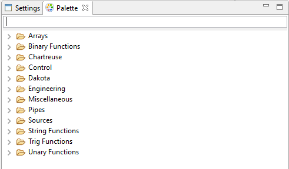
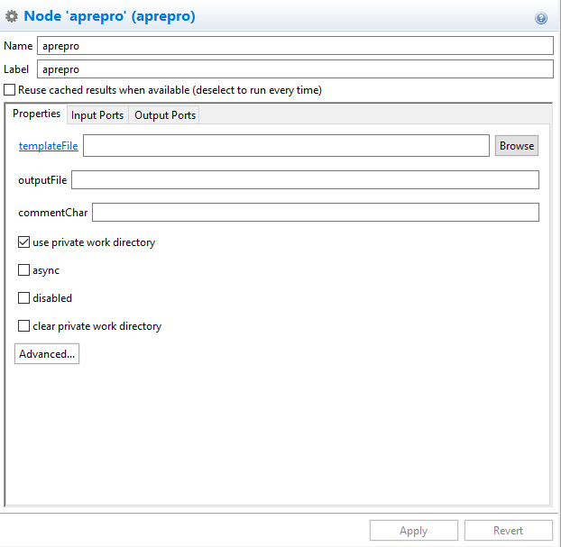

Next-Gen Workflow
=================

The Dakota GUI includes a node-based workflow creation tool called "Next-Gen Workflow" (NGW from this point on).  NGW is an extremely useful standalone tool for building workflows to process data, but it is primarily included as part of Dakota GUI to facilitate more complex Dakota analysis drivers.  With NGW, you can fully customize the flow of information between Dakota and your simulation model using a series of nodes that are visually connected together.

```{eval-rst}
.. toctree::
   :maxdepth: 1
   
   NextGenWorkflowTutorial
   NextGenWorkflowExpertMode
   NextGenWorkflowMultipleAnalysisDrivers
   NextGenWorkflowSurrogates
```

## Next-Gen Workflow Basics

<a name="ngw-basics"></a>

### The Palette
The Palette view provides all NGW nodes in a hierarchical folder structure, organized by topic.



If this view is not already present in your perspective, add it by going to "Window > Show View > Other… > Palette."

### Settings Editor for Workflow Nodes

The Settings Editor view is used quite heavily as part of NGW, so if your perspective doesn’t have the Settings editor view yet, get it from "Window > Show View > Settings."

The contents of the Settings Editor view changes depending on what is in focus on the NGW workflow canvas.  For instance, this is the view for an aprepro node:



Take a moment to familiarize yourself with the controls in this view that are common to most NGW nodes:

* **Name** The name of this node.  It appears in the top-left corner of the node’s box on the canvas.
* **Label** The label of this node.  This is text that appears above the node to describe what the node is doing.  Feel free to edit this field to be more descriptive for your workflow.
* **Properties Tab** This tab contains all the fields necessary to edit this node’s behavior.
* **Input Ports** This tab enumerates all of this node’s input ports.  You can add and remove input ports here.  Removing pre-defined input ports is not recommended.
* **Output Ports** This tab enumerates all of this node’s output ports.  You can add and remove output ports here.  Removing pre-defined output ports is not recommended.

To learn more about each NGW node's configuration options, click on the small "?" button to the right of the Settings editor banner.


### Running Workflows


When you have the NGW workflow canvas open in the editor area, the action bar along the top of the screen will look like this.  Note the two side-by-side play buttons.

* **Prompt for info and run the workflow** The leftmost play button will prompt you for a parent run directory to run the workflow inside of (the default option is the IWF file’s parent directory, but you may want to run the workflow somewhere else).
* **Run the workflow in the last used location** The rightmost play button will not prompt you and will run the workflow in the most recent run directory (or the default, which is the IWF file’s parent directory, if this is your first run).