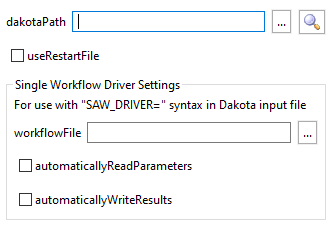

Dakota Workflows in "Expert Mode"
=================================

By default, Next-Gen Workflow manages the cycle of parameters and responses between itself and Dakota.  Behind the scenes, Dakota is [writing its parameter information to a file](ExternalSimulationModelOverview.html#parameter-and-response-format), which Next-Gen Workflow knows how to read at the beginning of your analysis driver workflow.  Likewise, behind the scenes, Next-Gen Workflow is [writing the output response values to a file](ExternalSimulationModelOverview.html#parameter-and-response-format), which Dakota knows how to read.

If you wish to manually manage the raw transfer of information for these Dakota-formatted parameters and results files, you may do so, although the resulting analysis driver workflow will be more complex.

Let's go through each of the changes:

* **Use a file node to read the parameter file from Dakota**:  This file node must look for the file specified in your Dakota input file by the *parameters\_file* keyword.  In this example, Dakota is writing to a file called "params.txt".
* **Use a dakotaParametersMap node** to read the contents of the parameters file.  This node will give you direct access to all the data structures that Dakota provides.  Most importantly, you will have access to the key-value pairs of parameter labels and values, represented in the workflow as the node's "variables" output port, which produces a map object.  You can provide this map to any of the pre-processing nodes through their inputParametersMap input port.
* **Use a dakotaResultsFile node** to format your quantities of interest into Dakota result file format.  In this example, we can make use of the qoiMap output port from our qoiExtractor node, which provides the results of our QOI expressions as a map of key-value pairs.  The dakotaResultsFile node is then responsible for translating this map into the text format that Dakota can read.
* **Use a file node to write the results file for Dakota**: This file node must write to the file whose name is specified by the *results\_file* keyword in your Dakota input file.  In this example, we pass the output from the dakotaResultsFile node to the dataIn port of the file node.

**One last, but important note:** When it comes time to [make the outer workflow that executes Dakota](Wizards.html#dakota-wrapper-workflow-wizard), you must make sure to alter the properties of the dakota node:

By default, "automaticallyReadParameters" and "automaticallyWriteResults" will be checked, indicating to Next-Gen Workflow that it should handle the Dakota parameters/results files for you.  Unchecking both boxes will indicate that you wish to manually handle these files yourself.