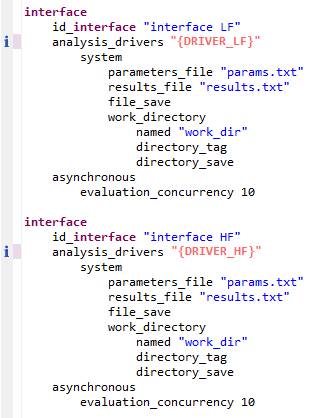
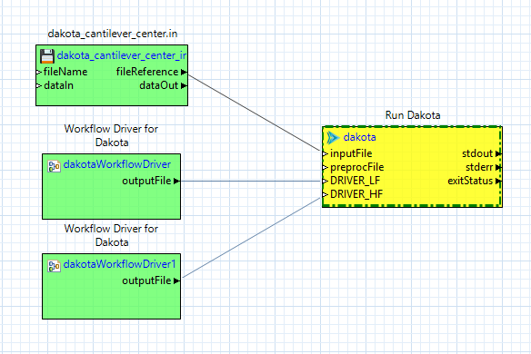

Using Multiple Dakota Analysis Drivers in Next-Gen Workflow
=================

Dakota GUI provides support for hooking up multiple, workflow-based analysis drivers to Dakota studies that have multiple interface blocks.  This is done by combining the features of DPREPRO and NGW.

For example, suppose we have two interface blocks in a given Dakota input file (as seen in multi-level multi-fidelity studies).  In these types of Dakota studies, we interface to a low-fidelity model (LF) and a high-fidelity model (HF).  Instead of providing explicit paths to a low-fidelity driver and a high-fidelity driver following each "analysis_drivers" keyword, let's add two pieces of DPREPRO markup - **"{DRIVER\_LF}"** and **"{DRIVER\_HF}"** (note the quotes).  The text within the DPREPRO brackets is arbitrary, but the markup text must be consistent going forward.

Now, this Dakota study will not run by itself anymore, since the text now needs to be pre-processed.  Let's switch over to Next-Gen Workflow to create a workflow that will run Dakota for us.

There are two things that need to happen on this workflow.  The first is that we need to provide one dakotaWorkflowDriver node per analysis driver.  Each dakotaWorkflowDriver node should point to the appropriate IWF file that will function as the analysis driver.

The second thing to do is to connect each dakotaWorkflowDriver node to a "dakota" workflow node using new input ports that match the text of the DPREPRO markup.  For example, we should add an input port called "DRIVER\_LF" to correspond to our {DRIVER\_LF} markup.  Then, the dakotaWorkflowDriver node that knows about the low-fidelity analysis driver should be connected to this input port.  The same should be done with a "DRIVER\_HF" input port and the dakotaWorkflowDriver node that knows about the high-fidelity analysis driver.

Once this is done, running the workflow will cause Dakota to execute the nested workflow analysis drivers as defined.