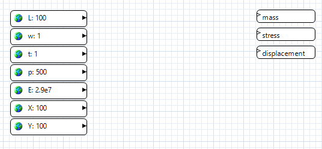
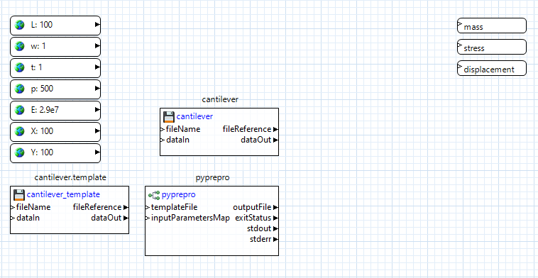
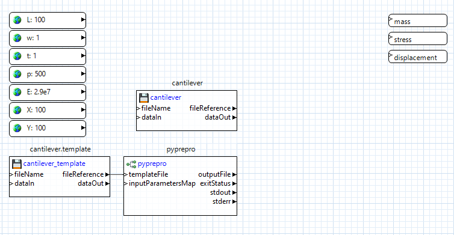
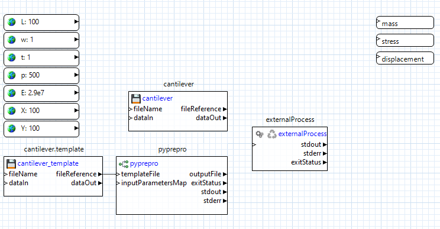
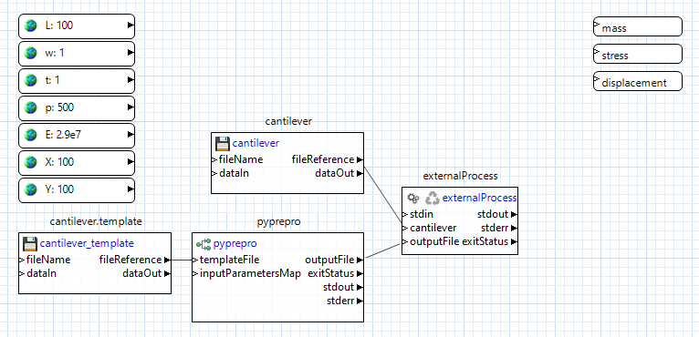
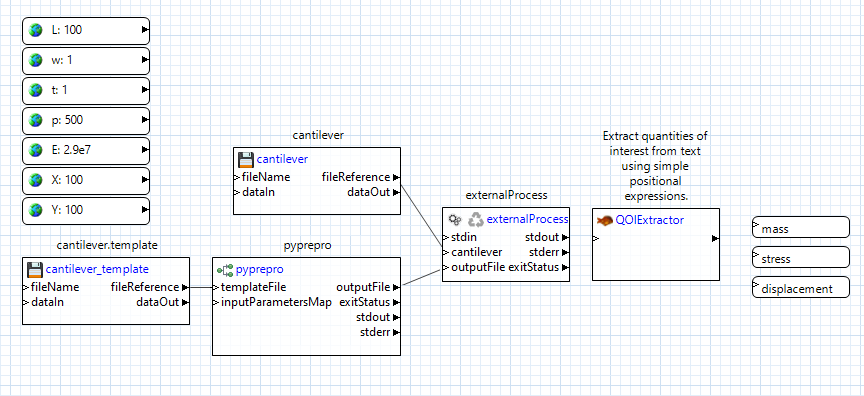
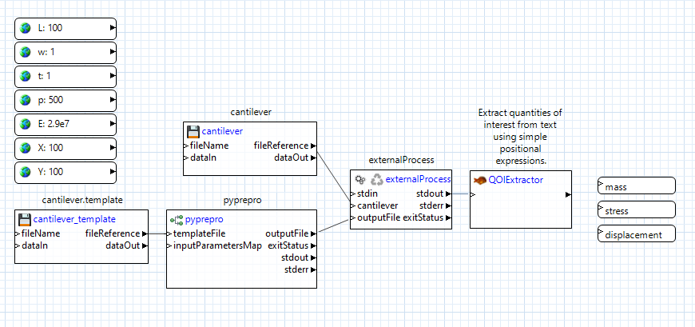

```{eval-rst}
.. _gui-nestedworkflowtutorial-main:
```

Create a Nested Workflow Driver for Dakota
==========================================

This section shows you the concrete steps for creating a workflow-based Dakota analysis driver.  This is meant to be an exemplary tutorial, and not the "only" way to do things.  In practice, you can use any combination of nodes to get from point A to point B; in fact, you are encouraged to experiment with NGW to see what it is capable of.

We will use the classic cantilever beam problem for this example, [available in the shipped Dakota example files](DakotaExamples.html#offline-examples-search).

## Prerequisites

* **Setup your system path to include Dakota!** Some workflow nodes require access to the bin directory of Dakota (for example, the "dprepro" node).  As a result, before you create any workflows that will be executed as analysis drivers for Dakota, make sure that Dakota's "bin" directory is available on your operating system's path ("PATH" variable on Unix, "Path" variable on Windows).
* Your cantilever.template **must be marked up with DPREPRO-supported markup**.  Consult the section on [marking up a template file](ContextMenuTools.html#markup-file) if you need help with this.  The following example will use DPREPRO, but you may use APREPRO instead if you wish.  Just note that aprepro uses slightly different syntax.
* You must first create a new workflow using the [Workflow-Based Dakota Driver wizard.](Wizards.html#workflow-based-dakota-driver)  


Double-click the IWF file generated by the Workflow-Based Dakota Driver wizard to get a look at the workflow canvas:



These nodes were generated thanks to the Workflow-Based Dakota Driver wizard.  Now all that’s left is to create intermediate nodes that pass information between the input parameters and output responses.

## Pre-Processing

Let's focus on pre-processing first.  In the Palette view, expand the "Dakota" folder.  Select "dprepro" and drag it onto the workflow canvas.  This node is responsible for running the "dprepro" pre-processing utility that typically comes shipped with Dakota.


One of the nice things about the dprepro node is that is does not require explicit connector lines to be drawn from each parameter node into itself.  Rather, the mere presence of global parameter values is enough for the dprepro node to work with.  The "aprepro" node could be used in exactly the same way.

Using the Project Explorer view, not the Palette view, drag the "cantilever" executable file onto the canvas.  NGW will automatically convert "cantilever" to a file node.  Do the same for the "cantilever.template" file that we previously marked up.



Connect the "fileReference" output port of the cantilever.template node to the "templateFile" input port of the dprepro node.  This will let dprepro know which template file to place the global parameter values in.



## Simulation Model Execution

Let's focus on executing the simulation model next.  Using the Palette, expand the Pipes folder and drag the "externalProcess" node onto the canvas.  This node is responsible for performing the execution of our black-box simulation model.



Now, from dprepro's "outputFile" output port, drag a connector to the blank space beneath "stdIn" on the externalProcess node to create an input port also called "outputFile."  Then, drag a connector from the cantilever file node’s "fileReference" output port to blank space on the externalProcess node to create an input port also called "cantilever".



Let's review what's happening here.  We have provided the externalProcess node with references to two files – the "cantilever" executable file that is sitting in our workspace, and to a processed input file that doesn’t exist yet, but will be created by the dprepro node at runtime.

Next, we need to tell the externalProcess node what to do with these two files.  The "cantilever" executable is actually a Python script with the .py extension removed; because of that, we’ll need to call it using Python.

Click on the externalProcess node to bring up its properties in the Settings editor view.

In the "command" field seen in the Settings editor view, type the following:

	python ${cantilever} ${outputFile}

Note the syntax of dollar signs and curly brackets.  These are **tokens** that will get replaced at runtime as appropriate.  They will be replaced because *the token names match the names of input ports for this node*, so NGW will know what to replace the tokens with.  Essentially, what we are saying here is "replace the token ${cantilever} with a path to the cantilever file, and replace the token ${outputFile} with a path to the processed input file when it gets created by dprepro node."  This relieves the user from having to worry about paths to files that can potentially change as the workflow is running.

## Post-Processing

Now let’s post-process the output from our cantilever executable.  From the "Dakota" folder in the Palette view, drag a qoiExtractor node onto the canvas:



The "qoiExtractor" node works with "QOIs" (short for "quantity of interest"), which is simply a value extracted from a body of unstructured text.  These are the values that will eventually be returned to Dakota as responses.

Our cantilever black-box simulation model only prints out to the console, so we can grab the externalProcess node's "stdout" output port, and drag a connector from it to the qoiExtractor node's "inputText" port to forward all output stream text into the qoiExtractor node:



Click on the qoiExtractor node to bring up its properties in the Settings editor view:


We need to now tell this node what quantities of interest (QOIs) to extract from the stream of input text it's going to receive.  Because the qoiExtractor node will connect directly to our already-created response nodes, we're going to need to extract three QOIs from the text – “mass,” “stress,” and “displacement.”

Click on "Add QOI Extractor."  In the first dialog that pops up, type in "mass" and click OK.  Use the next dialog to extract "mass" from the expected output of the "cantilever" executable.

[If you've never used a QOI extractor before, take a detour to learn about QOIs and how to extract them using the Dakota GUI.](QOI.html)

Follow the same process to create QOI extractors for "stress" and "displacement."

When you’re done, your settings editor view should look something like this:


Click on Apply in the bottom-right corner of the Settings editor view to save the changes.  Note that something has happened to the qoiExtractor node.  For each new QOI extractor that we added, a new output port with the same name has been added to the qoiExtractor node.  Each output port knows how to forward the value of the corresponding extracted QOI, so now all that remains is to connect each of these output ports to the already-created response nodes.


And we're done!

## Running this workflow by itself


If you defined initial values for each of your input parameters, then at this point, you can hit one of the two play buttons on the action ribbon to see this workflow run in isolation, as well as test whether it's working as expected.  It's highly recommended that you verify that the workflow behaves correctly by itself before attaching it to a Dakota study.

### What happens when Dakota calls this workflow?

So, we now have a workflow that can read in parameters and return response values.  This is cool, but what we want eventually is for Dakota to provide new parameters on each Dakota iteration.  How do we do that?

1. [We need to create a Dakota study that will drive the workflow, using the New Dakota Study wizard.](Wizards.html#dakota-study-wizard)
2. [After that, we will need to create a second, outer workflow that knows how to launch a Dakota study that uses the workflow engine as its analysis driver.](Wizards.html#dakota-wrapper-workflow-wizard)
