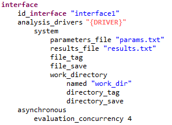
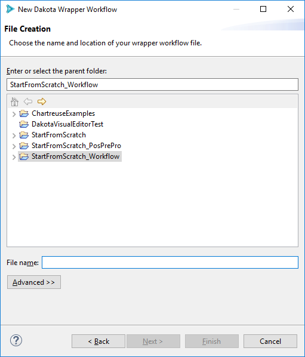
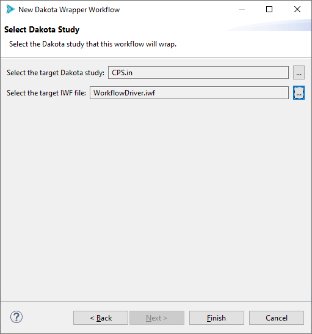

New Dakota Wrapper Workflow
=======

"Why would I want to create an workflow that does nothing but execute a Dakota input file?" you may be asking yourself.

A Dakota study that was created using the [New Dakota Study wizard](#dakota-study-wizard) and set up to interface with a [Next-Gen Workflow IWF file as the analysis driver](NextGenWorkflow.html) will have an interface block that looks something like this:

Note that the value for the [*analysis\_drivers*](https://dakota.sandia.gov//sites/default/files/docs/latest_release/html-ref/interface-analysis_drivers.html) keyword is DPREPRO markup.  This means that the Dakota study will not run by itself.  Executing "dakota -input my\_cool\_input_file.in" on the command line won't work for this input file, and neither will using an Eclipse run configuration.  We need a tool that has enough context to appropriately substitute the DPREPRO markup with the correct IWF file as an analysis driver.

For this situation, we need to create a **second wrapper workflow** that launches Dakota for us.  This is the right answer because the "dakota" node in Next-Gen Workflow knows how to substitute DPREPRO markup.  Additionally, Next-Gen Workflow also provides a special node that converts IWF workflow files into run-ready Dakota analysis drivers.

*Note:* Older versions of Dakota GUI and Next-Gen Workflow relied on a special "SAW\_DRIVER" string to make the connection that is now handled through DPREPRO.  "SAW\_DRIVER" is now considered a deprecated mechanism for connecting Dakota to Next-Gen Workflow, and we recommend replacing it with the DPREPRO syntax shown in this section.

You can access the Dakota Wrapper Workflow Wizard via "File > New > Other" and then "Dakota > Dakota Wrapper Workflow".  You can also right-click on a Dakota input file and choose "New > Wrapper workflow for Dakota".

This wizard is extremely short.  On the first page, choose a name and location for your wrapper workflow (a common convention is to call it "RunDakota.iwf")

On the second and final page of the wizard, use the first file selector control to select your target Dakota input file, and use the second file selector control to select the target IWF file.  If you used the context menu option for launching the wizard, the first field will already be populated.

Hitting Finish will generate a run-ready workflow that executes your Dakota study in concert with your chosen IWF file as the analysis driver (via the dakotaWorkflowDriver node):

