New Script-Based Dakota Driver
=======

The Script-Based Dakota Driver Wizard allows you to create an [analysis driver for Dakota](ExternalSimulationModelOverview.html) that is a script file.  This script file will facilitate the transfer of input parameters and output responses between a Dakota study and your external simulation model.

You can use this wizard even before you've created your Dakota study - all you need is a list of supported variable labels and supported response labels that you want the driver script to handle.  We recommend using the [BMF](BMF.html) file format to define this list of variables and responses if you don't yet have a Dakota study.  If you do already have a Dakota study, you can simply provide the Dakota study as the source of variables and responses.

In this version of Dakota GUI, [Python 3](https://www.python.org/downloads/) is the only language that is supported for generated driver scripts, so you will need to have Python 3 installed to run the generated script.  The GUI no longer supports generating Dakota driver scripts that are compatible with Python 2.

Open the Script-Based Dakota Driver wizard by going to File > New > Script-Based Dakota Driver.

## Page 1 (Welcome)

The first page of the wizard is a welcome page that provides some overview information about this wizard.  There is nothing that needs to be done on this page.

## Page 2 (Python File Creation)

Select the project location and name of your new Python driver script.

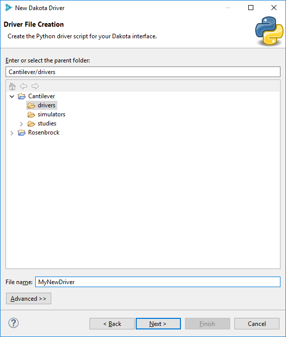

## Page 3 (Data Source Files Selection)

On this page, we provide our driver script with two things – information about the parameters and responses we’ll be using, and the path to our simulation model executable.

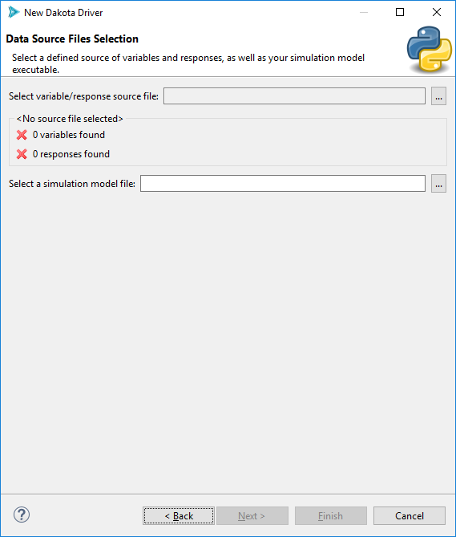

For the first file selector field ("Select variable/response source file"), click on the ellipsis button and choose your source of variables and responses.  As discussed earlier, this could be a [BMF](BMF.html) file, or possibly a Dakota study file.  After selecting a file, this wizard should register the number of variables and responses found in that file:

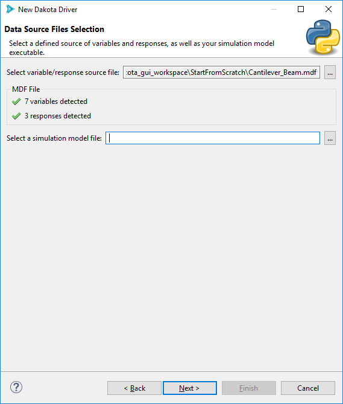

For the second file selector field (“Select a simulation model file”), you are not required to use resources imported into the Dakota GUI workspace.  You can browse to anywhere on your file system to get the simulation model file.  You could also simply type in the name of your simulation model executable file (for instance, if it is on your system PATH).

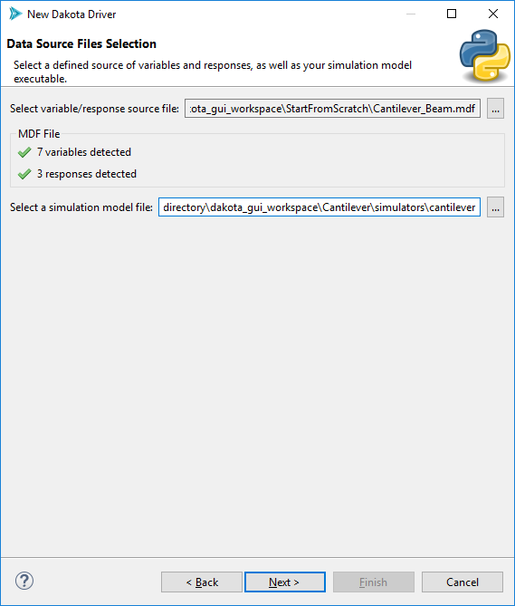

## Page 4 (Map Variables to Simulation Model Input)

This page of the wizard covers the pre-processing step.  There are two ways to pre-process a file in this wizard - you can either provide text-based pre-processing markup, or define positional pre-processors.

### Text Markup (APREPRO or DPREPRO)

If you've defined APREPRO or DPREPRO as your preferred pre-processor in the [global Preferences for Dakota GUI](Preferences.html#highlighter), you will see the following page:

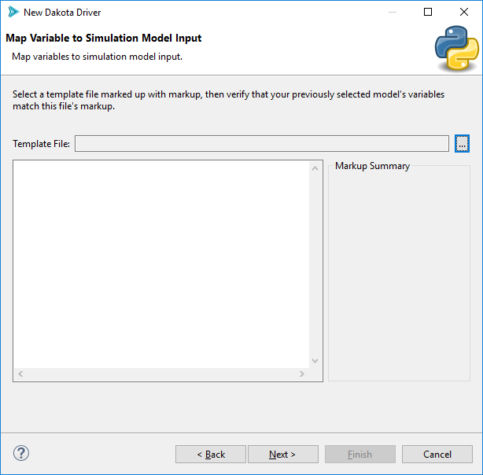

All that is required on this page is to provide a marked-up template file using the "Template File" file selector:

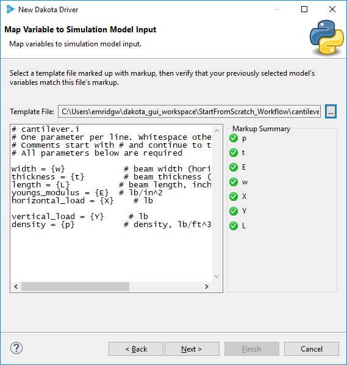

After selecting a marked-up template file, the wizard will perform a check that compares detected markup in your file against the list of variable labels you provided earlier.  If everything is good, all variables will have green checkmarks next to them in the "Markup Summary" group.  If a variable label could not be matched to any markup in the file, then a red X will appear next to that variable:

On the other hand, partial matches that the wizard is suspicious of will receive a yellow caution sign.  These might still be replaceable at runtime, depending on whether you are using APREPRO or DPREPRO, but it's not guaranteed to work.

If you need help marking up a template input file in the first place, we recommend exiting the wizard and using the [Markup File tool](ContextMenuTools.html#markup-file).

### Positional Pre-processing

If you've defined Positional Pre-processing as your preferred pre-processor in the [global Preferences for Dakota GUI](Preferences.html#highlighter), you will see the following page:

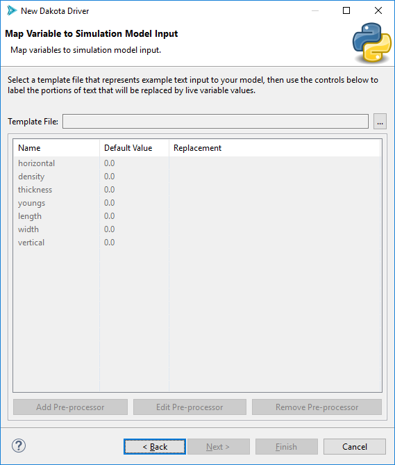

The "Template File" file selector allows you to provide an example input file that will be pre-processed at runtime.

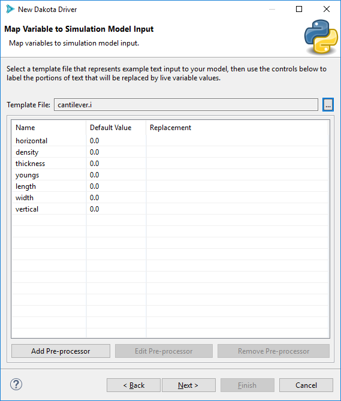

Note that this wizard auto-populates the table with variable labels.  These variable labels came from the variable/response source file that you provided earlier.  You may add or remove variables from this list if you wish (adding variables is not really recommended, but not disallowed either).

To add pre-processor information, select a variable from the list and then select "Edit Pre-processor."

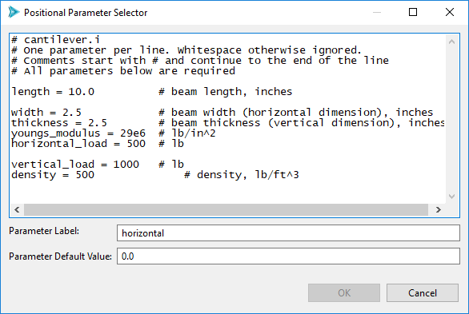

In this new dialog, highlight the portion of text you want to replace at runtime.  In the example screenshot below, the text "500" will be replaced by whatever value that Dakota provides for the input variable "horizontal".

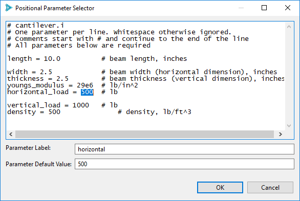

When you're done, select OK.  Here is an example of what your wizard page could look like after filling in all of the input variables with positional pre-processor information.

## Page 5 (Map Simulation Model Output to Dakota Responses)

This page of the wizard is concerned with quantity of interest (QOI) extraction.

Again, the table is pre-populated with response labels extracted from your selected variable/response source file.  Like with the pre-processing page, you may add or remove responses (not recommended, but possible).

The Script-Based Dakota Driver wizard knows how to extract QOIs from two potential sources:

* The standard output stream (i.e. console text) of your simulation model.
* A single destination file on your system (i.e. a log file).  This is not recommended if you plan to run Dakota with multiple threads.

You may opt to provide an example file to aid in QOI extraction, but this is an optional step.

For each response label that is imported, click on its row in the table and select "Edit QOI Extractor".  [If you've never used a QOI extractor before, take a detour to learn about QOIs and how to extract them.](QOI.html)

When you're done, this page of the wizard will look something like this:

## Page 6 (Execution)

This last page of the wizard has several controls to help with the task of actually executing your simulation model.

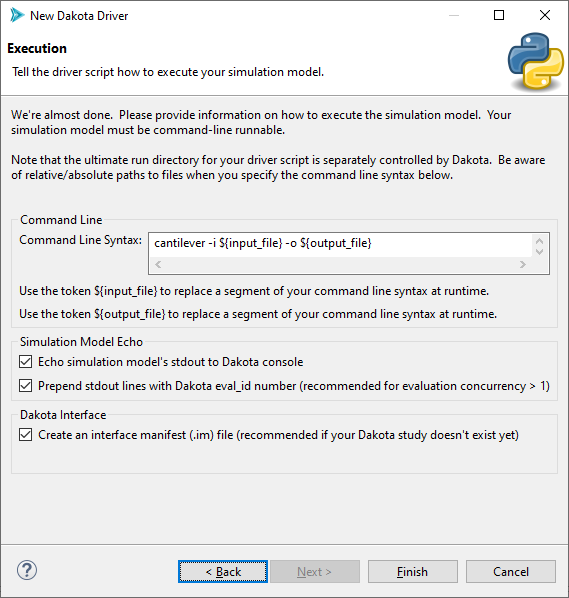

Let’s go through the options one by one:

* **Command Line Syntax** This text field allows you to specify how to execute your simulation model on the command line.  The driver wizard tries to be smart and provide you with some recommended default command line syntax, but most likely, you will need to change it.
 * There are two tokens you can use to perform runtime replacements of your command-line syntax – `${input_file}` and `${output_file}`.  Because our generated driver script will be creating new input files for the simulation model, we can’t hard-code an input file name, but we can use `${input_file}` to tell the driver script to provide the **newest input file to the simulation model**, whatever that input file may be at runtime.  `${output_file}` works similarly, in that you can tell the driver script about the **newest output file destination for the simulation model**.
* **Simulation Model Echo** When your simulation model runs, it will often print to the console.  You can instruct Dakota to include the simulation model's standard output stream in its own output stream if the "Echo simulation model’s stdout to Dakota console" box is checked.  If your Dakota study will be running multiple iterations in parallel (which is recommended), you run the risk of many simulation model output streams becoming tangled in one console output window.  To resolve this, you can prepend your simulation model’s output stream with numbers that indicate which Dakota iteration it's on.  Use the second checkbox to achieve this.
* **Dakota Interface** There should only be a single checkbox in this field – “Create an interface manifest (.im) file.”  What is an interface manifest?  Because a Python script does not have any inherent mechanism for declaring what variables and responses it expects to handle for Dakota, this information can be stored in an interface manifest file that sits next to the generated Python script.  Do not uncheck this box if you want to use [the Dakota Study wizard](#dakota-study-wizard) next; that wizard requires that analysis drivers declare their compatible variables and responses.

## Finishing

When you're all done, click Finish.  If all went well, your new Python driver script should appear as a new file in your Dakota GUI project.  It should also receive an additional interface manifest (.im) file.

If you know the Python language, you are now free to make additional modifications to the script if you so desire.